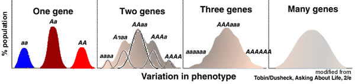
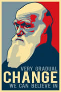
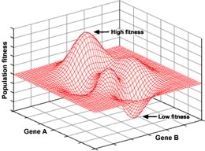
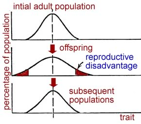
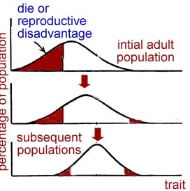
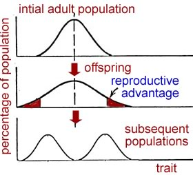

###Adaptation, Fitness, & Selection

* * * * *

Although some traits are difficult to measure, others are simpler to
quantify. 

How smart, or good, or funny, or sensitive a person is depends upon how
you define “smart”, “good”, “funny” or “sensitive” - and probably
exactly when, where, and how you make your measurements.

These traits, although real, are difficult to quantify; it may be very
difficult to study them scientifically. 

On the other hand, there are traits that are easier to measure.  Height,
body or brain weight, reaction times, tooth size, resistance to specific
pathogens, arm or leg length, or hair color – these are traits that can
be measured in a quantitative manner.

If we were to measure a large enough population of organisms with
respect to one of these “quantifiable” traits, we could determine a
frequency distribution for the trait. 

For many traits, this distribution is a **normal distribution**, You can
identify a normal distribution because it is symmetrical around a peak;
the peak value is the [mean of the
distribution.](mean%20and%20deviation.htm) 

Generally traits that fall into a normal distribution are determined by
the action of multiple genes.  

* * * * *

On the other hand some traits, such as blood type (that is, whether you
have O, A, B or AB blood type), are discontinuous. Such traits are
generally controlled by distinct variations in a single gene.  All of
the traits studied by [Gregor Mendel](http://en.wikipedia.org/wiki/Mendelian_inheritance) were discontinuous.

Not all traits effect the ability of an organism to survive or reproduce
successfully. Natural selection acts directly on traits that alter
reproductive success.   

At the same time, it is possible for two traits to be linked so that
selection of one leads to selection of the other. The genes involved can
be located near one another on a particular chromosome or it may be that
the process of producing the selected trait also produces (or
influences) the other “non-selected” trait. 

If either is the case (and it often is), then the non-selected trait
will be found in the population not because it is in and of itself
advantageous, but because it accompanies the selected trait.  We will
return to the organization of genes and chromosomes later in the
course. 

This is worth keeping in mind whenever someone tries to explain the
presence of a particular trait based on its presumed benefits.

* * * * *

Assuming that a trait has a genetic component, over time **selection**
can act to modify the frequency of that trait within a population.
Selection can maintain a trait in the face of genotypic and mutational
variation (conservative selection), it can move a trait or traits in a
particular “direction” (directed selection), or it can split a
population into organisms with distinct traits (disruptive selection).

Generally the process of selection occurs gradually, over many
generations, and acts on individuals within a population.  As selection
acts, and the population changes, the degree to which a particular trait
influences reproductive success may change, for example, a trait that is
beneficial when rare may be less beneficial when common. 

There are cases where selection can influence “social” traits, such as
cooperation, parenting, and altruism, even if these traits reduce the
reproductive success of the individual that displays them. 

How is this possible? It involves a process known as “inclusive
fitness”, and it applies when organisms are closely related. If a
particular behavior enhances the reproductive success of organisms
closely related to an individual, it can be selected even if it
decreases the reproductive success of that
individual.[[link](http://rstb.royalsocietypublishing.org/content/364/1533/3135.full)] 

Inclusive fitness is involved in the evolution of sexual reproduction,
multicellular organisms and their social and eusocial
behaviors. [[link](http://www.ncbi.nlm.nih.gov/pubmed/20740005.1)]

Although we are illustrating the effects of selection as if it were
acting along a single dimension, for example smaller to larger, in fact
traits can vary along a number of dimensions. 

A more appropriate type of graph would be a three-dimensional surface
(but it is harder to draw.) 

**Conservative selection**: It is possible that individuals with traits
at either end of the population distribution may be at a reproductive
disadvantage compared with organisms that are closer to the mean.

With each generation, the contribution of these “outliers” to the next
generation will be reduced. The distribution’s mean will remain
constant, but its standard deviation will decrease.

The stronger the disadvantage the outliers face, the narrower the
distribution will become.  In the end, the size of the standard
deviation will reflect i) the strength of selection against outliers and
ii) the rate at which new variation enters the population.

**Directed selection**: What happens when certain values of a trait
positively impact survival while others have a negative impact on
reproductive success? 

Assuming that the trait has a genetic component, over time the mean will
move in the direction of the positive effect, and away from the negative
one.      

**Disruptive selection**: A third possibility is that the organisms with
traits at the extremes of the population distribution actually have a
reproductive advantage over those nearer the mean. 

This type of behavior would tend to expand the population distribution,
while mating between organisms at the extremes would tend to bring the
population distribution back to the original state. 

If organisms at the extremes preferred to mate with organisms with the
same form of the trait, the population would, eventually, split into
two. 

Such a mating preference could itself be a selectable trait, and would
represent the formation of a reproductive barrier. 

As an example, consider selection for beak size in birds. While
typically considered important in feeding, it also influences the sounds
the bird makes [[link](http://www.ncbi.nlm.nih.gov/pubmed/14718504)],
which in turn could influence who finds who sexually attractive
[[link](http://news.nationalgeographic.com/news/2004/08/0827_040827_darwins_finch.html)],
which in turn could lead to reproductive isolation.

* * * * *

**Questions to answer**

1.  Why is it that the more genes that determine a trait, the more
    continuous is the distribution of that trait in a population?
2.  Why does variation never completely disappear even in the face of
    conservative selection?
3.  Develop a scenario that leads to disruptive selection and
    speciation.
4.  Explain the caveats associated with assuming that you know why a
    trait was selected.

* * * * *