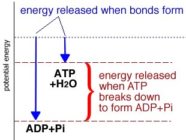
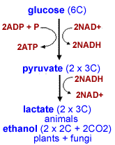

##Capturing and Storing energy

* * * * *

Organisms use energy to build complex and unstable biological molecules,
maintain their structural organization (for example, maintain chemical
gradients across their membranes), and to build copies of themselves.

There are two sources of energy available to organisms: chemical (molecules) and
electromagnetic (light).

When you consider molecules, you will realize that biologically useful
energy is held in molecular electron orbitals; there are no nuclear
reactions going on inside cells.

The structure of a molecule’s electron orbitals determines the amount of
energy stored in each electron. When an electron is added to a molecule
the energy of the molecule increases and the molecule is said to have
been “reduced”.

](./img/redOx1.gif)

And yes, it does seem weird that adding an electron “reduces” a
molecule.

If an electron is removed, the molecule’s energy is lowered and the
molecule is said to have been “oxidized”.

Since electrons can neither be created nor destroyed (remember, no
nuclear reactions), the reduction of one molecule is always coupled to
the oxidation of another. For this reason, reactions of this type are
referred to as [redox
reactions](http://naio.kcc.hawaii.edu/chemistry/basic_model.html).

There are many compounds in the natural world from which organisms can
extract energy. Lithotrophs or [rock
eaters](http://www.bact.wisc.edu/microtextbook/Metabolism/lithotrophs.html)
extract energy from inorganic compounds, such as elemental sulfur (S),
molecular hydrogen (H~2~), and methane (CH~4~).

Most higher organisms (like plants, fungi, and animals) are either phototrophs, which extract energy from
light, or chemoorganotrophs, which extract energy from organic
molecules. You yourself are a chemoorganotroph.

The larger the change in free energy (ΔG) associated with a reaction,
the more energy is released or absorbed when the reaction occurs. 

Consider wood, which is mainly composed of the carbohydrate polymer
cellulose [C~6~H~10~O~5~]~n~

The burning of wood can be written as a chemical reaction. cellulose +
O~2~ ↔ nCO~2~ + nH~2~O

*Figure: Cellulose is a polymer of glucose (sugar)*

This reaction has a high negative free energy (ΔG), it is exothermic (releases energy to the surroundings.)
That means, the energy stored in the bonds of cellulose and O~2~ is less
than that stored in the bonds of CO~2~ and H~2~O. The difference is
released as heat (thermal motion, that is increased kinetic energy).

At the same time, the activation energy of this reaction is high, which
is why books do not spontaneously burst into flames. While
thermodynamically favorable (because ΔG is negative), it does not occur
spontaneously (at least if we use the word spontaneously as it is
normally used in English).

Once started, however, the energy released during the reaction acts to
maintain the reaction – the reaction becomes self-sustaining and
continues until the reactants are used up.

In order to be biologically useful, however, highly exothermic reactions
must be controlled and the energy released must be captured in a useful
form. It is hard for an organism to capture, at the molecular level, the
energy of a fire.

To capture energy, cells use step-by step processes. As an example, a
molecule of sugar is broken down by a cell in a tightly controlled,
[step-by-step
process](http://en.wikipedia.org/wiki/Glycolysis) known as
glycolysis, from the Greek words meaning sweet (glyco) and splitting
(lysis).

The energy released is captured through synthesis of a number of
unstable compounds, including ATP.

**Questions to answer**

1. Why is the burning of wood self-sustaining?
2. Why are oxidation and reduction always coupled?
3. Why are carbohydrates a good source of energy?
4. In a typical cell, where do you think the energy released from the oxidation of sugars go?   

* * * * *

**Storing energy in molecules and gradients**

There are a number of ways that cells store energy. The synthesis of ATP
from adenosine diphosphate ADP and inorganic phosphate (Pi) is the most
familiar.

As you (hopefully) appreciate, whenever a bond is formed, energy is
released - it always takes energy to break a bond

Generally, the energy required to break bonds comes from the kinetic
energy of surrounding molecules (similarly the energy released upon bond
formation is often transformed into kinetic energy).

When we think about a molecule like ATP and energy, we have to consider
all of the bonds that are broken and formed in the process.

ATP is typically formed from ADP and Pi. We have to break a number of
rather stable bonds in both ADP and Pi to form the new and rather
unstable ADP- Pi bond in ATP. [what makes ATP unstable?]

Another class of “high energy/low stability” molecules involves the
reduction of certain compounds. For example, the addition of two
electrons and a proton to nicotinamide adenine dinucleotide (NAD^+^)
leads to the formation of the high energy/unstable molecule NADH.

] ]

Similarly, the addition of two electrons and two protons to flavin
adenine dinucleotide (FAD) leads to the formation of FADH~2~

Both NADH and FADH~2~ are high energy/unstable compounds, like ATP. When
electrons are removed from NAPH or FADH~2~, that is when these molecules
are oxidized, this energy is released, and NAD^+^ and FAD are
regenerated.

The energy carried by NADH and FADH~2~ is used to drive a number of
cellular reactions, it can also be used to generate ATP.

* * * * *

How does the cell use the energy stored in NADH and FADH~2~ to make ATP?
The answer came from the work of an eccentric British scientist, [Peter
Mitchell](http://www.biology.ucsd.edu/%7Emsaier/transport/petermitchell/one.html)
It is known as the chemiosmotic hypothesis.

*Figure: Peter Mitchell, click the image to learn more*

Mitchell proposed that the energy held in NADH and FADH~2~ was used to
generate a concentration gradient of H^+^ across the plasma membrane in
bacterial cells.

Electrons, removed from NADH or FADH~2~, pass through an electron
transport chain.

The electron transport chain is a set of membrane proteins that interact
with one another in pairs of redox reactions.

As high energy electrons move from one component of the electron
transport chain to the next, the first is oxidized, the second is
reduced, some energy is "bled-off’ and used to pump H^+^s out of the
cell, forming an H^+^ concentration gradient across the membrane.

<embed width="420" height="345" src="http://www.youtube.com/v/uniFehcAhHc" type="application/x-shockwave-flash"> </embed>

*Tutorial: Watch the tutorial: Electron transport in bacteria & archaea.*

**ATP synthases** consist of two parts, the F~o~ membrane channel and
the F~1~ ATP synthase. The ATP synthase mediates a series of coupled
reactions. The first is the movement of H^+^s down their concentration
gradient (through the ATP synthase).

The ATP synthase couples this thermodynamically favorable reaction with
a second reaction, the ADP + Pi ↔ ATP + H~2~O reaction, which is
thermodynamically unfavorable.

It is worth noting that there is nothing about this reaction that stops
it (under the right conditions) from running backward. When this occurs,
the ATP synthase acts as an ATPase and a pump that can move H^+^s
against its concentration gradient.

<embed width="420" height="345" src="http://www.youtube.com/v/J8lhPt6V-yM" type="application/x-shockwave-flash"> </embed>

*Movie: Watch synthase in action!*

As H^+^s move through the ATP synthase, the molecule rotates, this
rotation “forces” ADP + Pi together to form ATP.

<embed width="420" height="345" src="http://www.youtube.com/v/a39W-XFPB8E" type="application/x-shockwave-flash"> </embed>

This (above) is a higher magnification view of the process, where you can see
ADP and Pi binding, ATP formation, and then release.

* * * * *

**Back to electrons:** So where do the electrons end up? They have to go
somewhere!

O~2~ is a very efficient oxidizer, that is, an acceptor of electrons
from other molecules. In the presence of O~2~ and an electron transport
chain, NADH and FADH~2~ are oxidized to form NAD^+^ and FADH (they are
recycled).

The electrons pass through the electron transport chain, as they move
H^+^s are moved across the membrane to form a H^+^ gradient.

Eventually four of these electrons (and four H^+^s) are added to two
O~2~s, creating two water molecules. Again this is a thermodynamically
favorable reaction.

Under aerobic conditions (that is in the presence of O~2~), glucose can
be broken down completely to CO~2~ and H~2~O; much (\~60%) of the energy
originally present in the glucose molecule is captured as ATP (what
happens to the rest?)

In the absence of O~2~, that is under anaerobic conditions, the
breakdown of pyruvate to CO~2~ and H~2~O cannot occur - the energy in
pyruvate is unavailable to the cell.

The cell contains limited amounts of NAD^+^ and NADH (can you imagine
why?)

In order for a cell to continue to metabolize glucose, it must
regenerate its NAD^+^. In the absence of O~2~, the regeneration of
NAD^+^ involves the oxidation of NADH by pyruvate.

Most of the energy present in the glucose molecule is still present in
products of this reaction; only about 6% of the energy present in
glucose is captured in the absence of molecular oxygen.

* * * * *

**Questions to answer**

1.  When a bond forms, where does the energy go?
2.  What would happen to a cell’s ability to make ATP if it where
    exposed to a H^+^ carrier or channel?
3.  In your body, describe a situation in which glucose might be
    metabolized to water and carbon dioxide.
4.  Where or when might pyruvate (or some other intermediate)
    accumulate?
5.  What would happen if ATP synthase molecules were oriented
    randomly within the membrane, some pointing one way, some the other?
6.  Does the bacterial cell create H^+^s, and if not, where do they
    come from?
7.  How do you suppose an electron moves through an electron
    transport chain? Make a graph that describes its energy as it moves
    through the chain.

**Questions to ponder**

-   Which do you think would have an evolutionary advantage, an organism
    growing aerobically on anaerobically?
-   How do environmental conditions influence your answer?

* * * * *
