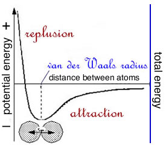
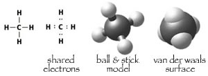
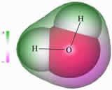
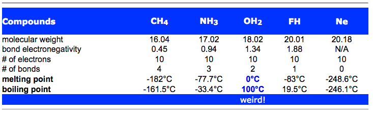
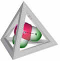
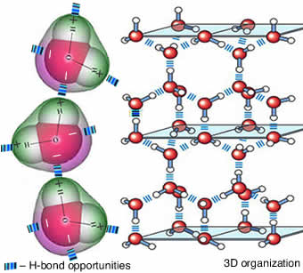
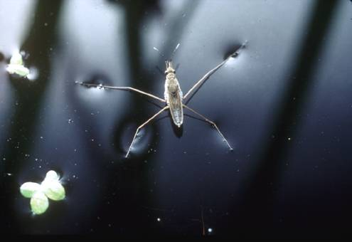
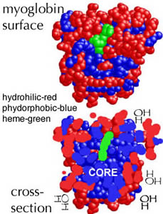

###Atoms, chemical bonds, and macromolecular structure

* * * * *

Approximately 70% of the total mass (i.e., weight) of living organisms is water. You are mostly made of water; for a person with a total body mass of 73kg (~160 pounds),  54kg (~130 pounds) of that mass is water.    

There is a profound relationship between water and life. It is quite likely that life arose in an aqueous environment, although the exact steps involved in going from a non-living to a living system remains the subject of ongoing research. Without water there would most likely be no life, as we know it, on this planet.

You should be comfortable with the universal fact that water, and all matter, are mode of atoms. Water is composed of 2 hydrogen atoms bonded to an oxygen atom; thus the chemical formula for water is H~2~O (the subscripts refer to the number of atom in the molecule). Water possesses "special" properties that allow it to sustain life. The properties of water arise from the properties of water molecules. These properties arise from the properties of atoms and interactions between them in water molecules. 

Water molecules are the major determinant of how cells and their components are organized and how they function. Water is also vital too many of the chemical reactions that occur in living systems, these reactions support and produce the quality that we call life. Without water, cells and the properties of life that we associate with cells would probably not exist.

This means that to understand (i.e. make sense of) biological systems we need to know some basic physics and chemistry, specifically atomic and molecular structure, atomic and molecular interactions, and (some) thermodynamics [[CLUE Chemistry link](http://besocratic.colorado.edu/CLUE-Chemistry/index.html)].

**Atoms:** In 1963, Nobel Laureate Richard Feynman (1918-1988), one of the most accomplished and influential scientists of the 20th century, wrote: 

> "If, in some cataclysm, all of scientific knowledge were to be destroyed, and only one sentence passed on to the next generation of creatures, what statement would contain the most information in the fewest words? I believe it is the atomic hypothesis (or the atomic fact, or whatever you wish to call it) that all things are made of atoms—little particles that move around in perpetual motion, attracting each other when they are a little distance apart, but repelling on being squeezed into one another. In that one sentence, you will see, there is an enormous amount of information about the world, if just a little imagination and thinking are applied.” (Feynman 1963)

Although it may seem a bit intimidating, your ability to understand basic concepts of biological systems depends upon understanding atoms. At the same time, it is worth admitting that atoms are so unreal, from the perspective of your everyday experience, that the [atomic theory](http://en.wikipedia.org/wiki/Atomic_theory) could pose a serious barrier to understanding basic concepts. You may not believe in atoms, but you do have to understand them. 

The smallest particle of matter that you can see with your naked eye contains more atoms than there are people in the world. Atoms are unimaginably small; we have yet to actually observe them directly. Indirect observation suggests that atoms consist of a very (very) small, but very dense nucleus that contains protons (+ charge) and neutrons (no charge), which is surrounded by electrons (- charge), which are very light, relatively. The space occupied by moving electrons accounts for the vast majority of the volume of an atom. 

 

Because the number of positively charged protons and negatively charged electrons are equal, and the size of the charges are the same (but opposite), atoms are electrically neutral when taken as a whole, that is: each positively charged proton is counterbalanced by a negatively charged electron.

**Questions to answer:** 

+ Is it obvious that the material world is composed of atoms? 
 
**London dispersion forces (a universal glue):** All atoms and molecules interact with one another through what are known as London dispersion forces (LDF), these are the basis for **[van der Waals interactions](http://chemwiki.ucdavis.edu/Physical_Chemistry/Quantum_Mechanics Intermolecular_Forces/Van_Der_Waals_Interactions)**.

LDF arise from the weak electrical fields that arise from the movement of negatively (-) charged electrons around positively (+) charged nuclei. These movements lead to a weak and "flickering" electrical field, a temporary dipole,

As two molecules approach, these electric fields interact and attract one another. This attraction is strongest when two molecules are separated by what is known as their van der Waals radii.

 

As they get closer, this attraction rapidly turns into a strong repulsion. Each atom and each molecule has its own characteristic van der Waals radius. This is the closest distance two molecules can normally come to another.

When we think about the energy of van der Waals interactions, it is important to realize two facts. First according to the laws of thermodynamics, the total energy in the system is constant: energy can not be created nor destroyed, just transformed from one form to another.

 

While you have probably heard about Einstein's famous equation E (energy) = m (matter/mass) x c^2^ (where c is the speed of light), energy to matter (and visa versa) conversion does not occur under conditions compatible with life (but rather in the interior of stars, during the explosion of a nuclear weapon, or in gigantic[particle colliders](http://public.web.cern.ch/public/en/LHC/LHC-en.html)).

The second fact to keep in mind is that atoms or molecules that approach each other and bond (i.e., remain "stuck" together) always have lower energy than the atoms/molecules alone. That is, of course what the word "bond" implies.

* * * * *

**Bond stability**: When atoms or molecules interact through London dispersion forces, the bond energies are weak. That is, the attraction between atoms/molecules is not very strong; this is, of course, relative to energy associated with other types of bonds/interactions. At the molecular level, and taken individually, these are some of the weakest forces acting on atoms and molecules
 
In a solution (like water or air), molecules are moving rapidly. The temperature of the system is a measure of their average kinetic energy. The amount of energy associated with the motion of atoms or molecules in a solution = 1/2 (mass x (velocity)^2^). (You can calculate your own kinetic energy using this formula!)

Under the conditions where life exists (e.g., temperature in the room right now), the kinetic energy of the average molecule is greater than the potential energy of the van der Waals interactions between atoms (and small molecules) - so the bonded atoms (molecules) are knocked apart due to collisions with other rapidly moving molecules/atoms.

**Covalent bonds**: In van der Waals interactions, the atoms/molecules retain their hold on their electrons. There are cases, however, where atoms come to "share" each other's electrons. This sharing, known as a covalent bond, produces a much stronger bond interaction. This strong bond substantially lowers the energy and the system (interacting atoms) becomes more stable.

 

*Movie: Click on the image above and watch the tutorial on Covalent Bonding*

When atoms form a bond, their van der Waals surfaces merge to produce a new molecular van der Waals surface.

There are a number of ways to draw molecules, but the space-filling or van der Waals surface view is the most realistic(at least for our purposes).

* * * * *

**Polar covalent bonds & enhanced intermolecular interactions:** So far, we have been considering covalent bonds in which the sharing of electrons between the atoms involved is more or less equal. The electronegativity of an atom is a measure of how tightly it holds onto its electrons.

Each type of atom (element) has its own characteristic electronegativity. If the electronegativities of the two atoms in a bond are equal or close, then the electrons are shared more or less equally between them and the bond is said to be non-polar.

If the electronegativities of the two bonded atoms are unequal,then the
electrons will be shared unequally.

On average, bond electrons will spend more time around the more electronegative atom and less time around the less electronegative atom.

This leads to partially negatively and positively-charged sides to the bond. This produces an electrical field, known as a **dipole**. Such a bond is said to be **polar**.

*Movie: Click on the image and watch the tutorial on bonds and electronegativity.*

In biological systems, bonds between O (oxygen) and H (hydrogen), N (nitrogen) and H, and C (carbon) and O are polar - bonds between C and H are non-polar. In a polar bond, the excess negative charge is associated with the O or N, both of which have relatively high electronegativities.

The presence of bond dipoles (polarized bonds) leads to electrostatic interactions between molecules (like LDFs above). Since they often involve H bound to O or N, these interactions are known as hydrogen or H-bonds. This is an unfortunate choice of words, since H-bonds are not bonds in the covalent bond sense. 

They are stronger than van der Waals interactions and have a directionality to them - for an H-bond to form the atoms involved have to be arranged more or less along a straight line.

**Questions to answer:**

1.  Why do molecules begin to repel one another once they get closer than their van der Waals radii?
2.  Where does the energy released when a bond forms go?
3.  What determines if two molecules, bound together through non-covalent bonds, form a stable or unstable complex?

**Questions to ponder:**

1.  What would "total energy" look like as a function of distance
    between atoms?
2.  Under what conditions might the nuclei actually fuse together?

* * * * *

**What are the implications of bond polarity?** We can see the consequences of bond polarity by comparing the properties of molecules with and without polar bonds.

For example, CH~4~ (methane) and Ne (neon) have no polar bonds, whereas H~2~O (water), NH~3~ (ammonia), and FH (hydrogen fluoride) have three, two and one, respectively. All five have the same number of electrons (10).

Let us now compare the temperatures at which each compound turns from a solid to a liquid (its melting point) and from a liquid to gas (its boiling point).

The temperatures at which a compound melts or boils reflects how strongly the molecules of a compound interact with one another. That is, how "tightly" they stick together. The melting and boiling points of water are high compared to other molecules of similar weight.

 
**So why is water weird?**

Well, in addition to the presence of polar covalent bonds, we have to consider the molecule's geometry.

Each water molecule can take part in four hydrogen bonds with neighboring molecules - it has two partially positive Hs and two partially negative sites on the O.

 

*Figure: A water molecules geometry. Click the image to see the tutorial: Water: A Natural Wonder*

These sites of potential H-bonding are arranged in a nearly tetragonal geometry

 

Because of this arrangement, each water molecule can interact through H-bonds with four other water molecules. To remove a molecule from its neighbors, four H-bonds must be broken! Keep in my mind that it takes energy to break bonds.

In the liquid state, molecules jostle one another and change their H-bonded interaction partners constantly. Yet, each water molecule remains linked to multiple neighbors via H-bonds.

This molecular hand-holding leads to water's high melting and boiling points as well as its high surface tension. Water molecules are "glued" together due to the pattern of H-bonds that can form in solution.   

We can measure the strength of surface tension in various ways. The most obvious is the weight that it can support.

Water's surface tension has to be dealt with by all organisms. Some, like the water strider, use it to cruise along the surface of ponds.

As the strider walks on the surface of the water, the molecules of its feet do not form H-bonds with water molecules, they are said to be hydrophobic (literally: hate water). Hydrophobic interactions also explain why water and oil do not mix (see below)

*Figure: Water strider "walking on water". Click the image to read an article about how the water strider achieves this amazing trick.*

* * * * *

**Hydrophilic and hydrophobic behaviors:** Some molecules, like sugars,
alcohols,and most amino acids, dissolve readily in water, they are hydrophilic (literally: love water). Why do some molecules dissolve in water and others do not?

Think of water as a network with the links between the molecules formed by H-bonds.

To insert a molecule, **A**, into this network you have to break some of the H-bonds between the water molecules. If the**A** molecules can make H-bonds with water molecules, then there is little net change in the energy of the system.

Such molecules tend to be soluble in water - they are hydrophilic.

On the other hand, if **A** molecules cannot make H-bonds, then when these molecules are inserted into water the total number of H-bonds in the system decreases - the energy of the system increases (remember, bonds lower energy).

However, much of this change in "enthalpy" (i.e., the energy of the system increased) will be compensated for by van der Waals interactions. Something else must be going on.

  

*Figure: Which molecule is more likely to be water soluble, glycerol (left) or propane (right)?*

What is happening in this case is the system responds so as to maximize the number of H-bonds present. This requires that the water molecules become arranged in a shell around each **A** molecule. Such a shell is more ordered than the normal arrangement of water molecules. This results in a thermodynamically unfavorable **decrease** in the entropy of the system.   

 

*Movie: Click on the image to watch the tutorial: Water, entropy, and solubility*

It is primarily because of this decrease in entropy that molecules that
cannot make H-bonds with water are relatively insoluble in water -
they are hydrophobic.

As a general rule, the more polar bonds a molecule contains, the more hydrophilic it will be; the fewer polar bonds, the more hydrophobic. Basically, the more H-bonds it can make the more it "looks" like water.

At the same time, the smaller the molecule, the smaller are the effects of inserting it in between water molecules. The solubility of a molecule in water depends upon its size, shape, and the number of polar bonds it contains.

* * * * *

These general rules of molecular interactions with water also apply to **macromolecules**, such as **lipids** (fats), **carbohydrates** (sugars), **proteins**, and **nucleic acids** (DNA and RNA), the details of which we will consider later in the course.

Most macromolecules contain both hydrophilic and hydrophobic regions.

The hydrophobic regions will tend to be buried in the center of the molecule (or macromolecular complex), minimizing their interactions with water.

Carbohydrates (sugars) illustrate this rule - they are almost exclusively hydrophilic and tend to adopt an extended structure in solution.

In soluble proteins, hydrophilic regions tend to be on the outside, maximizing their interactions with water, while hydrophobic regions tend to be buried in the interior of the molecule (thus minimizing their interactions with water).

 

Because of the polar nature of their bonds, water molecules interact with ions, thereby making them soluble. Recall that ions are atoms that have lost or gained electrons. 

Take common table salt, NaCl, which normally exists as a crystalline solid.

The bonds between the Na and Cl atoms are totally ionic - electrons are not shared, rather Na gives up an electron and becomes Na^+^, while Cl accepts the electron and becomes Cl^-^. The solid is held together by electrostatic interactions (ionic bonds).

To remove a Na^+^ or a Cl^-^ ion from a salt crystal involves separating positive from negative charges.

In water, these charges are largely neutralized by interactions with the partially charged groups of the water molecules that result from H-bonds between O and H in the water molecule.

As salt dissolves, the Na^+^ and Cl^-^ ions become surrounded by a shell of oriented water molecules.

Water does the same thing to itself. 

It stabilizes its own dissociation into OH^-^ (hydroxyl) and H^+^ ions.

The H^+^ ion, a naked proton, does not exist as such, but is associated with water molecules, forming H~3~O^+^, H~5~O~2~^+^ and larger ions.

In pure water, [OH^-^] = [H^+^] are equal to 10^-7^ molar (# of atoms/volume). That means that in a solution of pure water there are 10^-7^ moles (# of atoms) of OH^-^ and 10^-7^ moles (# of atoms) of H^+^ per liter.  

**Note:** [OH^-^] = the concentration (# of atoms/volume) of hydroxide ions.  

*Movie: Click on the image and the tutorial: Dissolving salt and splitting water* 

While these are small numbers, small changes in the concentrations of
OH^-^ and H^+^ have important [effects](http://en.wikipedia.org/wiki/Acidosis) in biological systems.

Use your textbook to brush up on the definition of pH, and what it means to be an acid or a base.

* * * * *

**Questions to answer:**

1. Even with very water soluble molecules, such as sugars, there is a limit
to the amount that can be dissolved in a specific volume of water -- what might limit solubility?

2. Why is salt (NaCl) not soluble in non-aqueous (hydrophobic) solvents?

3. Why is it easier to separate Na^+^ and Cl^-^ ions surrounded by water than it is to separate "naked" Na^+^ and Cl^-^ ions?

**Question to ponder:**

1. You dissolve table salt in water - does the water become charged?

* * * * *
