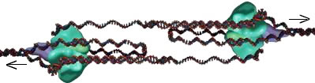
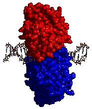
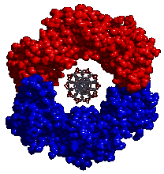
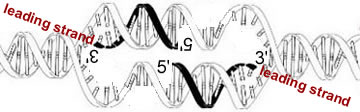

###DNA Replication

* * * * *

The double-helical structure of DNA immediately suggested to Watson and
Crick a simple mechanism for the accurate duplication of the genetic
information stored in DNA.

Each strand contains all of the information necessary to specify the
sequence of its complementary strand.

Polymerization (always) involves the reaction of an incoming
deoxynucleotide triphosphate (dNTP) with the 3’ hydroxy group of the
pre-existing polynucleotide chain
[[link](http://www.plosone.org/article/info%3Adoi%2F10.1371%2Fjournal.pone.0018881)].

The reaction releases pyrophosphate (P-P) and forms a phosphodiester
bond. The 3’ OH of the added dNTP becomes the new 3’ OH of the growing
polynucleotide.

The sequence of a polynucleotide is always **written in the 5’ to 3’
direction**, just as the sequence of a polypeptide is always written
from its N-terminus to its C-terminus (as we will see).

Both DNA and RNA polymerases synthesize nucleic acids by adding
nucleotides to the 3’-OH end of a molecule.

<embed width="420" height="345" src="http://www.youtube.com/v/WxrxPrTN9Gk" type="application/x-shockwave-flash"> </embed>

**DNA replication** is a complex process - the steps are mediated by
various proteins. In the bacterium [*Escherichia
coli*](http://www.plosgenetics.org/article/info%3Adoi%2F10.1371%2Fjournal.pgen.1000344)
over 100 genes are involved in DNA replication and repair.

Replication begins at specific sequences along the DNA strand, known as
origins of replication or origins for short.

Origin sequences are recognized by specific proteins. The binding of
these proteins initiates the assembly of an origin recognition complex,
an ORC.

In the laboratory, DNA is generally heated to 94-100°C in order to
insure complete denaturation (strand separation). In the cell, various
proteins act on the DNA to locally denature (unwind) the DNA to form a
replication bubble.

A multiprotein complex will assemble at each end of the replication
bubble, these structures are known as replication forks.

Using a single replication origin and two replication forks moving in 
opposite directions, a growing *E. coli* can replicate its \~4,700,000 base pairs 
of DNA in \~40 minutes.

Each replication fork moves along the DNA synthesizing \~1000 base pairs
of DNA per second

Synthesis is an accurate process; the polymerase makes about one error
for every 10,000 base pairs it synthesizes. Most of these errors are
quickly recognized, since they lead to the formation of a base mismatch.

When a mismatched base pair is formed, the DNA polymerase recognizes its
presence, reverses and removes it (using an exonuclease activity), and
than resynthesizes it, correctly.

This process is known as proof-reading; the proof-reading activity of
the DNA polymerase complex reduces the total DNA synthesis error rate to
\~1 error per 1,000,000,000 (10^9^) base pairs synthesized.

*****

**DNA replication and molecular machines:**

The process of nucleic acid replication involves a number of molecular
machines, we will consider only one as an example - the clamp loader.

Once DNA replication begins it is important that the polymerase complex
remains attached to the DNA.

This is accomplished by the assembly of a doughnut shaped protein, known
as a sliding clamp, around the DNA double helix.

<embed width="420" height="345" src="http://www.youtube.com/v/QMhi9dxWaM8" type="application/x-shockwave-flash"> </embed>

The clamp is added to DNA by a protein known as a clamp loader
[[link](http://www.ncbi.nlm.nih.gov/pmc/articles/PMC3331839/?tool=pubmed)].
Once closed around the DNA the clamp diffuses freely along the length of
the DNA molecule, but it cannot leave the DNA. The rest of the
polymerase complex is attached to the clamp.

 

*Figure: Molecular structure of the sliding clamp*

This keeps the polymerase complex from drifting away from the DNA. The
attached clamp-polymerase complex now assembles many nucleotides into a
new DNA strand before it falls off.

DNA-dependent, DNA polymerases cannot start a new DNA chain de novo or from nothing. 
They can only add nucleotides to a pre-existing DNA (or RNA) strand. 
Why this is, evolutionarily, is not known, but it is a conserved (homologous) feature of 
the DNA polymerases involved in DNA replication.

When the DNA helix opens there are no pre-existing DNA strands for the
DNA polymerase to extend.

So, how does synthesis start?

The answer is that a short RNA molecules, known as a primers,
complementary to the two strands of the open DNA, are synthesized by a
DNA-dependent, RNA polymerase - this enzyme is known as
[primase](http://chem-mgriep2.unl.edu/replic/Primase.html).

\

*Figure: DNA before primers are added via primase (top) and with primers (bottom)*

DNA polymerase synthesizes DNA onto the ends of these primers in the
standard 5’ to 3’ manner. These first primers define the leading strands
of DNA synthesis.

As the DNA forks move, more DNA is unwound, and new primers have to be
synthesized to insure replication of the “lagging strands”([watch this
animation](http://www.biostudio.com/d_%20DNA%20Replication%20Coordination%20Leading%20Lagging%20Strand%20Synthesis.htm):
quite nice, although very “flat”). No new primers have to be synthesized
on the leading strand.

Later in the DNA replication process, the RNA primers are digested away,
replaced with DNA, and joined together by the enzyme DNA ligase to
produce a single, uninterrupted replicated strand.

\

Eukaryotic cells can contain more than 1000 times the DNA found in a
typical bacterial cell. Moreover, the eukaryotic DNA replication enzyme
complex is much slower (about 1/20th as fast) than the prokaryotic
system.

While a bacterial cell can replication is circular, \~3 x 10^6^ base
pair chromosome in about 1500 seconds using a single origin of
replication. To replicate their DNA eukaryotic cells use multiple
origins of replication, scattered along the length of each chromosome.

Another topological complexity is associated with the replication (and
segregation) of closed circular DNA molecules, as well as extremely long
linear DNA molecules.

<embed width="420" height="345" src="http://www.youtube.com/v/EYGrElVyHnU" type="application/x-shockwave-flash"> </embed>

http://www.youtube.com/watch?v=EYGrElVyHnU&feature=player_embedded

The replication of DNA unwinds the DNA, and this unwinding requires
topoisomerases to allow replication to continue. 

A specific molecular machine acts when replication forks “crash” into
one another.

It resolves the strands and links them, leading to a single double
stranded DNA molecule per chromosome.

So even though they may contain 1000 times more DNA than *E. coli*, DNA
replication can still be completed in as little as 10 minutes.

Below is a video of the complex process of DNA replication (something to look
forward to if anyone goes on to take Molecular Biology!)

<embed width="420" height="345" src="http://www.youtube.com/v/4jtmOZaIvS0" type="application/x-shockwave-flash"> </embed>

* * * * *

**Questions to answer**

1.  What defines the directionality (polarity) of a polynucleotide
    chain?
2.  How does the DNA polymerase recognize a mismatched base pair?
3.  Why do you need to denature (melt) the DNA double-helix to copy it?
4.  How does the DNA polymerase complex know where to start replicating
    DNA?
5.  Make a cartoon of a prokaryotic chromosome, indicate where
    replication starts and stops. Now make a cartoon of a eukaryotic
    chromosomes. What specific issues are associated with the
    termination of DNA in each case?
6.  List all of the unrealistic components in the replication video?
7.  Is an RNA primer needed to make an mRNA, do you think?
8.  Why is only a single RNA primer needed to synthesize the leading
    strands, but multiple primers are needed to synthesize the lagging
    strands?
9.  During the replication of a single DNA molecule, how many leading
    and lagging strands are there?

**Questions to ponder**

-   Assume that there is a mutation that alters the proof-reading
    function of the DNA polymerase complex - what will happen to the
    cell?
-   Explain why, in the absence of the clamp, the polymerase could
    diffuse away from the DNA? Why might this be “bad”?
-   How do you think the clamp is removed?

* * * * *