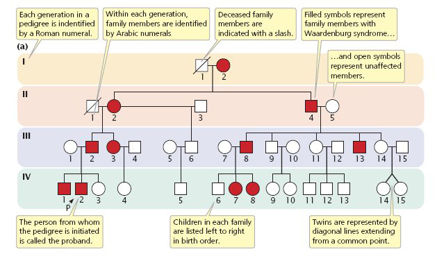
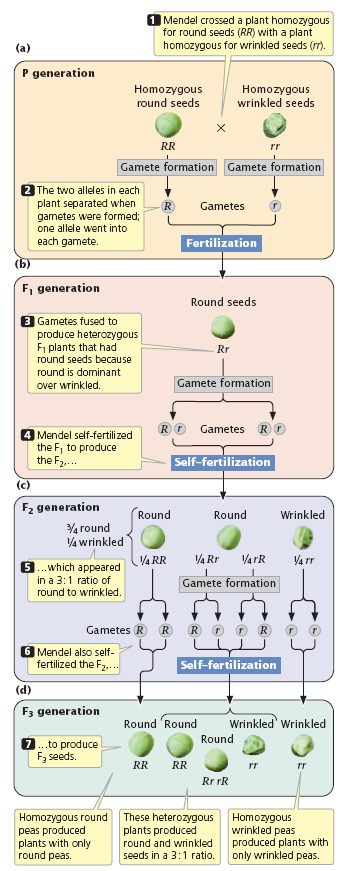
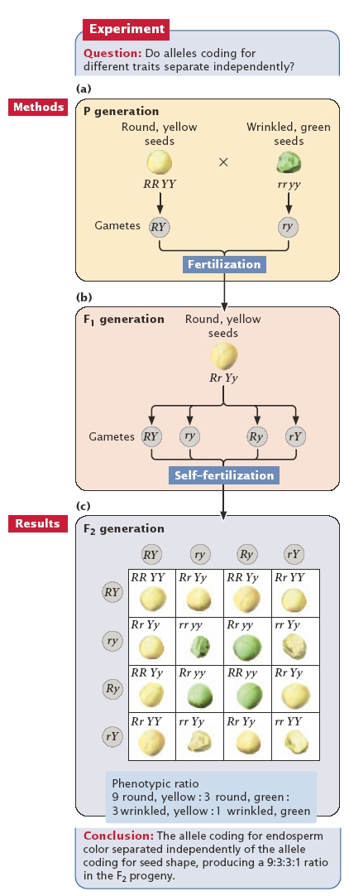

Gregor Mendel and the Principles of Inheritance
===============================================

By: Ilona Miko, Ph.D. (Write Science Right) © 2008 Nature Education 

##Gregor Mendel's principles of inheritance form the cornerstone of modern genetics. So just what are they?

Ever wonder why you are the only one in your family with your
grandfather's nose? The way in which traits are passed from one
generation to the next-and sometimes skip generations-was first
explained by Gregor Mendel. By experimenting with pea plant breeding,
Mendel developed three principles of inheritance that described the
transmission of genetic traits, before anyone knew genes existed.
Mendel's insight greatly expanded the understanding of genetic
inheritance, and led to the development of new experimental methods.

Traits are passed down in families in different patterns. Pedigrees can
illustrate these patterns by following the history of specific
characteristics, or phenotypes, as they appear in a family. For example,
the pedigree in Figure 1 shows a family in which a grandmother
(generation I) has passed down a characteristic (shown in solid red)
through the family tree. The inheritance pattern of this characteristic
is considered dominant, because it is observable in every generation.
Thus, every individual who carries the genetic code for this
characteristic will show evidence of the characteristic. In contrast,
Figure 2 shows a different pattern of inheritance, in which a
characteristic disappears in one generation, only to reappear in a
subsequent one. This pattern of inheritance, in which the parents do not
show the phenotype but some of the children do, is considered
[recessive](http://en.wikipedia.org/wiki/Category:Classical_genetics "recessive").
But where did our knowledge of dominance and recessivity first come
from?

**Gregor Mendel’s Courage and Persistence**
---------------------------------------
Our modern understanding of how traits may be inherited through
generations comes from the principles proposed by Gregor Mendel in 1865.
However, Mendel didn't discover these foundational principles of
inheritance by studying human beings, but rather by studying *Pisum
sativum*, or the common pea plant. Indeed, after eight years of tedious
experiments with these plants, and—by his own admission—"some courage"
to persist with them, Mendel proposed three foundational principles of
inheritance. These principles eventually assisted clinicians in human
disease research; for example, within just a couple of years of the
rediscovery of Mendel's work, [Archibald Garrod applied Mendel's
principles to his study of
alkaptonuria](http://www.esp.org/foundations/genetics/classical/ag-02.pdf "Archibald Garrod applied Mendel's principles to his study of alkaptonuria").
Today, whether you are talking about pea plants or human beings, genetic
traits that follow the rules of inheritance that Mendel proposed are
called Mendelian.

Mendel was curious about how traits were transferred from one generation
to the next, so he set out to understand the principles of heredity in
the mid-1860s. Peas were a good model system, because he could easily
control their fertilization by transferring pollen with a small
paintbrush. This pollen could come from the same flower
(self-fertilization), or it could come from another plant's flowers
(cross-fertilization). First, Mendel observed plant forms and their
offspring for two years as they self-fertilized, or "selfed," and
ensured that their outward, measurable characteristics remained constant
in each generation. During this time, Mendel observed seven different
characteristics in the pea plants, and each of these characteristics had
two forms (Figure 3). The characteristics included height (tall or
short), pod shape (inflated or constricted), seed shape (smooth or
winkled), pea color (green or yellow), and so on. In the years Mendel
spent letting the plants self, he verified the purity of his plants by
confirming, for example, that tall plants had only tall children and
grandchildren and so forth. Because the seven pea plant characteristics
tracked by Mendel were consistent in generation after generation of
self-fertilization, these parental lines of peas could be considered
pure-breeders (or, in modern terminology, homozygous for the traits of
interest). Mendel and his assistants eventually developed 22 varieties
of pea plants with combinations of these consistent characteristics.

Mendel not only crossed pure-breeding parents, but he also crossed
hybrid generations and crossed the hybrid progeny back to both parental
lines. These crosses (which, in modern terminology, are referred to as
F~1~, F~1~ reciprocal, F~2~, B~1~, and B~2~) are the classic crosses to
generate genetically hybrid generations.

**Understanding Dominant Traits**
-----------------------------

Before Mendel's experiments, most people believed that traits in
offspring resulted from a blending of the traits of each parent.
However, when Mendel cross-pollinated one variety of purebred plant with
another, these crosses would yield offspring that looked like either one
of the parent plants, not a blend of the two. For example, when Mendel
cross-fertilized plants with wrinkled seeds to those with smooth seeds,
he did not get progeny with semi-wrinkly seeds. Instead, the progeny
from this cross had only smooth seeds. In general, if the progeny of
crosses between purebred plants looked like only one of the parents with
regard to a specific trait, Mendel called the expressed parental trait
the dominant trait. From this simple observation, Mendel proposed his
first principle, the principle of uniformity; this principle states that
all the progeny of a cross like this (where the parents differ by only
one trait) will appear identical. Exceptions to the principle of
uniformity include the phenomena of
[penetrance](http://en.wikipedia.org/wiki/Penetrance "penetrance"),
[expressivity](http://en.wikipedia.org/wiki/Expressivity "expressivity"),
and
[sex-linkage](http://en.wikipedia.org/wiki/Category:Classical_genetics "sex-linkage"),
which were discovered after Mendel's time.

**Understanding Recessive Traits**
------------------------------

When conducting his experiments, Mendel designated the two pure-breeding
parental generations involved in a particular cross as P~1~ and P~2~,
and he then denoted the progeny resulting from the crossing as the
filial, or F~1~, generation. Although the plants of the F~1~ generation
looked like one parent of the P generation, they were actually hybrids
of two different parent plants. Upon observing the uniformity of the
F~1~ generation, Mendel wondered whether the F~1~ generation could still
possess the nondominant traits of the other parent in some hidden way.

To understand whether traits were hidden in the F~1~ generation, Mendel
returned to the method of self-fertilization. Here, he created an F~2~
generation by letting an F~1~ pea plant self-fertilize (F~1~ x F~1~).
This way, he knew he was crossing two plants of the exact same genotype.
This technique, which involves looking at a single trait, is today
called a monohybrid cross. The resulting F~2~ generation had seeds that
were either round or wrinkled. Figure 4 shows an example of Mendel's
data.

When looking at the figure, notice that for each F~1~ plant, the
self-fertilization resulted in more round than wrinkled seeds among the
F~2~ progeny. These results illustrate several important aspects of
scientific data:

1.  Multiple trials are necessary to see patterns in experimental data.
2.  There is a lot of variation in the measurements of one experiment.
3.  A large sample size, or "N," is required to make any quantitative
    comparisons or conclusions.

In Figure 4, the result of Experiment 1 shows that the single
characteristic of seed shape was expressed in two different forms in the
F~2~generation: either round or wrinkled. Also, when Mendel averaged the
relative proportion of round and wrinkled seeds across all F~2~progeny
sets, he found that round was consistently three times more frequent
than wrinkled. This 3:1 proportion resulting from F~1~ x F~1~crosses
suggested there was a hidden recessive form of the trait. Mendel
recognized that this recessive trait was carried down to the F~2~
generation from the earlier P generation.

**Mendel and Alleles**
------------------

As mentioned, Mendel's data did not support the ideas about trait
blending that were popular among the biologists of his time. As there
were never any semi-wrinkled seeds or greenish-yellow seeds, for
example, in the F~2~ generation, Mendel concluded that blending should
not be the expected outcome of parental trait combinations. Mendel
instead hypothesized that each parent contributes some particulate
matter to the offspring. He called this heritable substance "elementen."
(Remember, in 1865, Mendel did not know about DNA or genes.) Indeed, for
each of the traits he examined, Mendel focused on how the elementen that
determined that trait was distributed among progeny. We now know that a
single gene controls seed form, while another controls color, and so on,
and that elementen is actually the assembly of physical genes located on
chromosomes. Multiple forms of those genes, known as alleles, represent
the different traits. For example, one allele results in round seeds,
and another allele specifies wrinkled seeds.

One of the most impressive things about Mendel's thinking lies in the
notation that he used to represent his data. Mendel's notation of a
capital and a lowercase letter (*Aa*) for the hybrid genotype actually
represented what we now know as the two alleles of one gene:*A* and *a*.
Moreover, as previously mentioned, in all cases, Mendel saw
approximately a 3:1 ratio of one phenotype to another. When one parent
carried all the dominant traits (*AA*), the F~1~ hybrids were
"indistinguishable" from that parent. However, even though these F~1~
plants had the same phenotype as the dominant P~1~ parents, they
possessed a hybrid genotype (*Aa*) that carried the potential to look
like the recessive P~1~ parent (*aa*). After observing this potential to
express a trait without showing the phenotype, Mendel put forth his
second principle of inheritance: the principle of segregation. According
to this principle, the "particles" (or alleles as we now know them) that
determine traits are separated into gametes during meiosis, and meiosis
produces equal numbers of egg or sperm cells that contain each allele
(Figure 5).

 

**Dihybrid Crosses**
----------------

Mendel had thus determined what happens when two plants that are hybrid
for one trait are crossed with each other, but he also wanted to
determine what happens when two plants that are each hybrid for two
traits are crossed. Mendel therefore decided to examine the inheritance
of two characteristics at once. Based on the concept of segregation, he
predicted that traits must sort into gametes separately. By
extrapolating from his earlier data, Mendel also predicted that the
inheritance of one characteristic did not affect the inheritance of a
different characteristic.

Mendel tested this idea of trait independence with more complex crosses.
First, he generated plants that were purebred for two characteristics,
such as seed color (yellow and green) and seed shape (round and
wrinkled). These plants would serve as the P~1~ generation for the
experiment. In this case, Mendel crossed the plants with wrinkled and
yellow seeds (*rrYY*) with plants with round, green seeds (*RRyy*). From
his earlier monohybrid crosses, Mendel knew which traits were dominant:
round and yellow. So, in the F~1~ generation, he expected all round,
yellow seeds from crossing these purebred varieties, and that is exactly
what he observed. Mendel knew that each of the F~1~ progeny were
dihybrids; in other words, they contained both alleles for each
characteristic (*RrYy*). He then crossed individual F~1~ plants (with
genotypes *RrYy*) with one another. This is called a dihybrid cross.
Mendel's results from this cross were as follows:

-   315 plants with round, yellow seeds
-   108 plants with round, green seeds
-   101 plants with wrinkled, yellow seeds
-   32 plants with wrinkled, green seeds

Thus, the various phenotypes were present in a 9:3:3:1 ratio (Figure 6).

 

Next, Mendel went through his data and examined each characteristic
separately. He compared the total numbers of round versus wrinkled and
yellow versus green peas, as shown in Tables 1 and 2.

**Table 1: Data Regarding Seed Shape**

  ------------------------- ----------------- ----------------
                            **Round**         **Wrinkled**
  **Number of plants**      315 + 108 = 423   101 + 32 = 133
  **Proportion of total**   3.2               1
  ------------------------- ----------------- ----------------

**Table 2: Data Regarding Pea Color**

  ------------------------- ----------------- ----------------
                            **Yellow**        **Green**
  **Number of plants**      315 + 101 = 416   108 + 32 = 140
  **Proportion of total**   2.97              1
  ------------------------- ----------------- ----------------

The proportion of each trait was still approximately 3:1 for both seed
shape and seed color. In other words, the resulting seed shape and seed
color looked as if they had come from two parallel monohybrid crosses;
even though two characteristics were involved in one cross, these traits
behaved as though they had segregated independently. From these data,
Mendel developed the third principle of inheritance: the principle of
independent assortment. According to this principle, alleles at one
locus segregate into gametes independently of alleles at other loci.
Such gametes are formed in equal frequencies.

**Mendel’s Legacy**
---------------

More lasting than the pea data Mendel presented in 1862 has been his
methodical hypothesis testing and careful application of mathematical
models to the study of biological inheritance. From his first
experiments with monohybrid crosses, Mendel formed statistical
predictions about trait inheritance that he could test with more complex
experiments of dihybrid and even trihybrid crosses. This method of
developing statistical expectations about inheritance data is one of the
most significant contributions Mendel made to biology.

But do all organisms pass their on genes in the same way as the garden
pea plant? The answer to that question is no, but many organisms do
indeed show inheritance patterns similar to the seminal ones described
by Mendel in the pea. In fact, the three principles of inheritance that
Mendel laid out have had far greater impact than his original data from
pea plant manipulations. To this day, scientists use Mendel's principles
to explain the most basic phenomena of inheritance.

References and Recommended Reading
----------------------------------

Mendel, G. Versuche über Plflanzen-hybriden.Verhandlungen des
naturforschenden Ver-eines in Brünn, Bd. IV für das Jahr 1865,
Abhand-lungen, 3–47 (1866) (Bateson**translation) ([link to
article](http://www.esp.org/foundations/genetics/classical/gm-65.pdf "link to article"))

Strachan, T., & Read, A.P. Mendelian pedigree patterns. *Human Molecular
Genetics 2* (Garland Science, 1999)