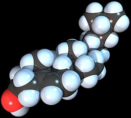
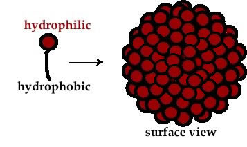
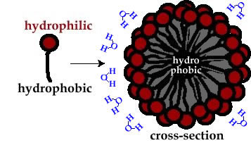
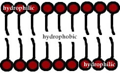
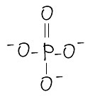
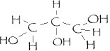
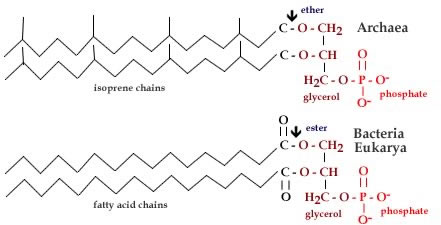

###Lipids and Membranes

****

Membranes are a defining feature of all cells. The plasma membrane defines the boundary between the outside and the inside of the cell.

The differences between the two are profound. Outside is mostly water, with few complex molecules.

Inside is a highly concentrated (\~ 60 mg/ml) solution of proteins,
nucleic acids, and smaller molecules, known collectively as cytoplasm.
This bounded system (the cell) has the properties of life. It can
reproduce itself by using energy imported from beyond itself.

The membrane controls and mediates the interactions between the cell and
the outside world. This includes what molecules can enter or leave the
cell, how the cell interacts with other cells, and (indirectly) the
overall shape of cells and their movements.

Cells are homeostatic. Assuming that a perturbation is not too severe,
the cell can recover and return to its “normal” state. Cells are also
adaptive, they can change their behavior in response to signals from
their environment. Most importantly, they have heredity, and so
populations of cells can evolve over time.

Biological membranes are composed of two general classes of molecules,
proteins (which we will discuss later) and lipids.

*****

**Lipids** are a structurally heterogeneous group of compounds
characterized by the presence of distinct hydrophilic and hydrophobic
domains.

For example the “fatty acid” stearic acid (above) has a “tail” of 17 carbon
atoms and their associated hydrogens attached to a carboxylic acid
(COOH) group.

In contrast, cholesterol (below) has a complex carbon-based ring structure, and
a single hydrophilic -OH group.

> *Figure:cholesterol, click on the image to read about cholesterol*

Molecules like cholesterol, stearic acid, and lipids in general have both hydrophobic and hydrophilic groups and are termed **amphipathic**; literally both (amphi) conditions (path).

The hydrocarbon regions of fatty acids and cholesterol (and other
lipids) are extremely hydrophobic and so are insoluble in water. In
contrast, the carboxylic acid group is extremely hydrophilic.

In aqueous solution, entropic effects will drive the assembly of lipids
into [micelles](http://en.wikipedia.org/wiki/Micelle), bilayers, and other more complex structures. These complex structures are known to form spontaneously when lipids are placed into water!

 

 

In these structures, the lipid’s hydrophobic tail is sequestered away
from contact with water, while at the same time, its hydrophilic head is
immersed in water.

* * * * *

**Building a membrane**: The plasma membrane is built on a foundation of lipids. There are many
different lipids found in membranes. In fact there is a new area of
study, known as [lipidomics](http://www.ncbi.nlm.nih.gov/pubmed/21318352) that examines the
diversity of lipids and their role on cell behavior and disease. It is
worth noting here that, unlike proteins, nucleic acids, and
carbohydrates lipids are not a structurally coherent group.

Structurally different molecules, such as cholesterol, lipids, and phospholipids,
are all considered lipids. What they have in common is their
amphipathic nature.

A major class of lipids found in all types of organisms are molecules
built by adding chemical groups to glycerol (which we introduced
previously as a highly hydrophilic molecule).

Glycerol has three hydroxyl (-OH) groups which are polar in nature. In the phosphoglycerol lipids,
one of these groups is linked to a phosphate group.

Phosphoglycerol is even more hydrophilic than glycerol (Do you know why?)

In the bacteria and eukarya (like your own cells), glycerol’s two other -OH groups are coupled
to unbranched fatty acid chains (like stearic acid above) through condensation (loss of water) reactions. This
forms an ester linkage between the fatty acid and the glycerol [moieties](http://en.wikipedia.org/wiki/Functional_group).

In the [Archaea](http://www.ucmp.berkeley.edu/archaea/archaeamm.html), microbes similar to bacteria,
branched isoprene chains (rather than fatty acids) are attached to
glycerol via ether linkages.

In water, both types of lipid molecules organize themselves to minimize
the exposure of their hydrophobic groups to water and to maximize their hydrophilic groups to water. 

This entropy-driven process leads to the formation of a bilayer membrane.

<embed width="420" height="345" src="http://www.youtube.com/v/lm-dAvbl330" type="application/x-shockwave-flash"> </embed>

*Movie: Click the image and watch an animation of a lipid membrane forming spontaneously* 

* * * * *

**Questions to answer**

1. How are the effects at the hydrophobic edges of a lipid bilayer
    minimized?
2. What types of molecules might be able to go through the plasma
    membrane on their own?
3. In the light of the cell theory, what can we say about the history
    of cytoplasm and the plasma membrane?
4. Why do fatty acid and isoprene lipids form similar bilayer
    structures?
5.  What is the effect of the phosphate attached to the glycerol group?
    Why is it there?

* * * * *

