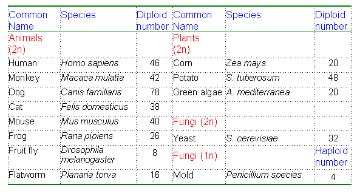
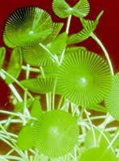
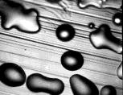
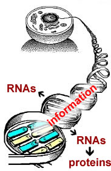

##Nucleic Acids & Heredity

****

It is not unusual for children to look like their parents. That children share 
physical traits (or characteristics) with their parents suggests that those traits 
can be passed from parent to offspring. This is a fact that humans have known for a long time.

One of the amazing facts (that may be less familiar) associated with [Darwin](http://en.wikipedia.org/wiki/Charles_Darwin) and [Wallace’s](http://en.wikipedia.org/wiki/Alfred_Russel_Wallace) original
[evolutionary hypothesis](http://en.wikipedia.org/wiki/Natural_selection) 
was their complete lack of a coherent understanding of genetic mechanism. That is, how are traits
passed from parent to offspring. 

While it was clear that organisms varied (just look around at your fellow class mates), 
and that part of that
variability was inherited, the mechanism by which genetic information
was stored and transmitted was completely unclear.

Beginning with the work of [Gregor Mendel](http://en.wikipedia.org/wiki/Gregor_Mendel) in the 19th century, which was
rediscovered and built upon beginning in the early part of the 20th
century, it became obvious that hereditary “factors” - which became
known as **genes**, were present as discrete objects that could be
passed (generally) unchanged from generation to generation.

Specific genes could exist in different forms, known as alleles (i.e., brown vs. blue eyes). In
higher organisms, two copies of each gene were present, one copy
inherited from the maternal parent (mom), the other from the paternal parent (dad).

It was, however, unclear what genes were made of, and how they stored
information.

* * * * *

**Discovering how nucleic acids store genetic information**

Nucleic acids were first isolated as part of the phosphorus-rich
compound nuclein from pus and sperm by Friedrich Miescher.

\
 
*Figure: Miescher and family. Click the image to learn more*

Later nuclein was resolved into an acidic component, nucleic acid,and a
basic component, primarily proteins known as histones.

Eukaryotic cells contain a distinct structure, the nucleus, where
nuclein was localized.

During cell division, the nucleus appeared to be replaced by densely
staining bodies, known as chromosomes.

<embed width="420" height="345" src="http://www.youtube.com/v/c6TlHINXSj8" type="application/x-shockwave-flash"> </embed>
*Tutorial: Genes and Chromosomes* 

In 1887 [Edouard van
Beneden](http://www.ijdb.ehu.es/web/paper.php?doi=1627480) (below) reported that
the number of chromosomes was a constant for each species.

Different species had different numbers of chromosomes.

In 1902, Walter Sutton published his observation that chromosomes obey
[Mendel’s rules of inheritance](http://en.wikipedia.org/wiki/Mendelian_inheritance).

This strongly suggested that Mendel’s genetic factors were associated
with the chromosomes.

That hereditary information was localized to nuclei was further
suggested by a number of observations, particularly the transplantation
experiments carried out by Joachim Hammerling in the 1930’s.

He showed that the information needed to control the morphology of the
giant unicellular green alga *Acetabularia*, the mermaid’s wineglass (above), was
located within the region of the cell that contained the nucleus.

<embed width="420" height="345" src="http://www.youtube.com/v/tl5KkUnH6y0" type="application/x-shockwave-flash"> </embed>
*Tutorial: Hammerling and Acetabularia*

* * * * *

The proof that DNA was the genetic material came from a series of
experiments initiated in the 1920s by Fred Griffith.

He was studying two strains of the bacterium *[Streptococcus
pneumoniae](http://www.cdc.gov/ncidod/dbmd/diseaseinfo/streppneum_t.htm).*

The two strains differed in the nature of the colonies they formed; in
one case the colonies were smooth, in the other case, the colonies were
rough.

 

*Figure: Smooth (left) and rough (right) Streptococcus pneumoniae*

He found that when cells of the smooth colony **S** strain were injected
into mice the mice quickly sickened and died.

However, during extended cultivation *in vitro*, the **S** strain
sometimes gave rise to rough **(R)** colonies.

Mice injected with **R** strain bacteria did not get sick.

Likewise, mice injected with heat killed S strain bacteria also did not
get sick. BUT, weirdly enough, mice co-injected with the living **R**
and dead **S** bacteria got sick and died! From these dying mice, he
isolated a new pathogenic smooth strain, which he termed **S-II**.

His hypothesis was that a non-living component derived from the dead
**S** bacteria had “transformed” the avirulent (benign) **R** strain into
the virulent **S-II** strain.

*****

**The molecular basis of transformation:**

In 1944, these studies were followed up by [Oswald Avery, Colin McLeod
and Maclyn McCarty](http://profiles.nlm.nih.gov/CC/A/A/N/V/). They set
out to use Griffith’s assay to isolate the transforming principle
responsible for turning **R** into **S** strains.

Their approach was to make cell extracts; they ground up cells and
isolated various components (such as proteins, nucleic acids,
carbohydrates, lipids).

They then digested (i.e., enzymatically destroyed) these extracts with various enzymes and asked whether
the transforming principle was still intact.

Treating cellular extracts with proteases, which degrade proteins
lipases, which degrade lipids, or RNAases, which degrade RNAs had no
effect on transformation.

In contrast, treatment of the extracts with DNAase, which degrades DNA,
destroyed the activity.

Furthermore, purification of the transforming substance suggested that
it had the properties of DNA and subsequent studies confirmed this
conclusion.

DNA isolated from **R** strain bacteria did not produce S-strain bacteria,
whereas DNA from **S** strain bacteria could transform **R** into **S**.

They concluded that DNA derived from **S** cells contains the information
required for the conversion – it is a gene or part of one.

*****

**Horizontal gene transfer:**

The process of transformation, the picking up and integrating of DNA
from the environment (as occurred during Griffith’s experiments) is
thought to have played a key role in early evolution and in the rapid
evolution of bacteria today.

*Figure: Bacteria can integrate foreign DNA into their genome.*

In the modern world, the rapid spread of antibiotic resistance is due to
horizontal gene transfer. Genes encoding factors involved in antibiotic
resistance are released from dying bacteria, and can be acquired by
their neighbors.

When we analyze the total DNA of an organism, its genome, we find
evidence for horizontal gene transfer, particularly within the bacteria
and archaea (another type of prokaryote).

* * * * *

**Questions to answer**

1.  Based on the data presented, is there a correlation between the
    number of chromosomes and the complexity of an organism?
2.  Would you expect that closely related species would have the same
    number of chromosomes?
3.  What caused the change from **S** to **R** strains in culture?
4.  In Griffith’s study, he found that dead smooth *S. pneumoniae* could
    transform living rough strains of *S. pneumoniae* when co-injected
    into a mouse (*in vivo*). Would another species of dead bacteria
    give the same result?
5.  How would Hammerling’s observations have been different if the
    hereditary information was localized in the cytoplasm?

**Questions to ponder**

-   How might horizontal gene transfer confuse molecular phylogenies (i.e.,evolutionary relationships)?
-   Where did the original genes come from?

*****