##Nucleic Acid Structure

**What are nucleic acids?**

Nucleic acids are [polymers](http://en.wikipedia.org/wiki/Polymer), that
is molecules built of repeating units. The basic repeating unit of
nucleic acids are known as nucleotides. A nucleotide consists of three
distinct chemical groups, a 5-carbon sugar (ribose or deoxyribose), a
nitrogen-rich base - (cytosine (C), guanine (G), adenine (A),
thymine (T) in DNA or uracil (U) instead of T (in RNA), and phosphate.

The nitrogenous base, either a
[purine](http://en.wikipedia.org/wiki/Purine) (adenine or guanine), or a
[pyrimidine](http://en.wikipedia.org/wiki/Pyrimidine) (thymine, uracil
or cytosine), is attached to the 1’ carbon of the sugar.

Nucleotides can exist in various phosphorylated forms, including
nucleotide monophosphate (NMP), nucleotide diphosphate (NDP), or
nucleotide triphosphate (NTP).

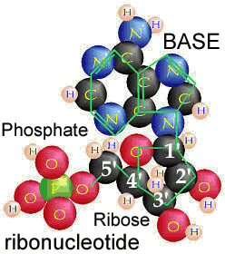__ 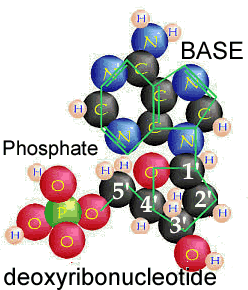

*Figure: Nucleotides found in RNA (left) and DNA (right).*

Nucleotide triphosphates can polymerize with one another through the
following reaction

**NTP + NTP + H~2~0 ↔ NTP-NMP + diphosphate**

This reaction leaves a triphosphate at 5’ end of the “dinucleotide” and
a 3’ OH group at the other.

Nucleic acid polymers are defined by their 5’ phosphate ends and 3’ OH
ends. They have a direction.

The reaction can continue; a dinucleotide can react with a nucleotide
triphosphate to generate a trinucleotide.

In this reaction, the 5’ phosphate of the NTP is lost and a
phosphodiester bond [-C-O-P-O-C] is formed, but the 3’ OH group remains,
and can react with another NTP.

In this way, nucleotide polymers of unlimited length can be generated.

Each such polymer has a 5’ phosphate end, a 3’ hydroxyl end,
phosphodiester linked nucleotides, and a direction.

Nucleotide assembly into polymers is a thermodynamically unfavorable
reaction made possible because it is coupled to thermodynamically
favorable NTP hydrolysis (ADP formation) reactions.

energy + ADP + phosphate ↔ ATP (favorable)

nucleotide mono- or diphosphate + phosphate(s) + ATP ↔ nucleotide triphosphate + AMP/ADP (favorable)

nucleic acid (N) + nucleotide triphosphate ↔ nucleic acid (N+1) + diphosphate (unfavorable)

* * * * *

**Discovering the structure of DNA**

A critical clue to understanding the structure of nucleic acids came
from the work of Erwin Chargaff.

When analyzing DNA, he found that the relative amounts of G, C, T and A
in DNA varied between organisms but were the same (or very similar) for
organisms of the same type or species.

On the other hand, the ratios of A to T and G to C were always equal to
1, no matter where the DNA came from [note: this rule does not apply to
RNA.]

Knowing these rules, James Watson and Francis Crick built a model of DNA
that fit the molecular and structural data, using structural data from
Rosalind Franklin.

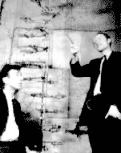

Their structure was double helical; two nucleotide polymer strands ran
anti-parallel to one another and the bases were stacked upon one another
in the center.

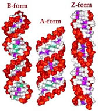

[Crick-Watson-Franklin](http://virtuallaboratory.colorado.edu/BioFun-Support/labs/Watson-Crick-Franklin/Watson-Crick-Franklin.html)

Their model was for what is now known as B-form DNA. Under different
conditions, DNA can form two other double helical forms, known as the A
and Z forms. A and B forms of DNA are “right-handed” helices, the Z-form
of DNA is a left-handed helix (pictured above).

Both purines and pyrimidines are flat in the ring plane. The upper and
lower surfaces of the rings are hydrophobic, while the edges are
hydrophilic.

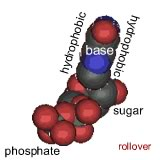 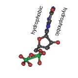

This means that the same factors that favor the assembly of lipids into
membranes are involved in nucleic acid structure.

To reduce their interactions with water, the interactions between
hydrophobic surfaces and water need to be minimized.

At the same time, each nucleotide has two very hydrophilic groups: a
negatively charged phosphate and a sugar (carbohydrate) group.

Both form H-bonds and will interact strongly with water. How can the
conflicting “molecular desires” of the nucleotides be satisfied?

The most obvious (shown below) way is to stack the hydrophobic surfaces of the
bases in the center of the molecule and place the sugars and phosphates
at the periphery, in contact with water.

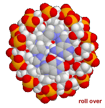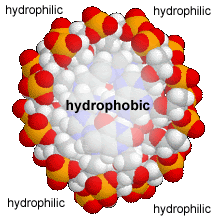

A “bases-inward” organization was key to Watson and Crick’s model of DNA
structure. At the same time, each base has a hydrophilic edge, with -C=O
and -N-H groups that can act as H-bond acceptors and donors.

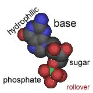 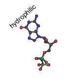

How are these hydrophilic groups arranged in the hydrophobic interior?

In all forms of DNA, the hydrophilic edges of the bases interact in a
very specific way.

An **A** forms two H-bonds with a **T** on the opposite strand, while a
**G** forms three H-bonds with a **C**.

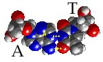\

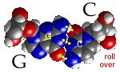

Both A::T and G:::C base pairs are the same length.

This has structural implications. Most importantly, the structure of a
DNA molecule is not significantly altered by the sequence of base pairs
along its length.

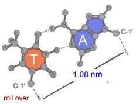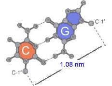

Any possible sequence can be found, at least theoretically, in a DNA
molecule. This means that DNA can be used to encode information in the
sequence of nucleotides along its length.

Second, the sequence of base pairs along one strand of a DNA molecule is
the complement of the base pair sequence on the other. The two strands
are informationally redundant; this is of practical importance, for the
repair of mutated DNA.

If you know the sequence of one strand of a double-stranded DNA
molecule, you automatically know the sequence of the other,
anti-parallel strand. This has important implications for the
replication of hereditary information.

* * * * *

**RNA structure:**

Ribonucleic acid or RNA differs from DNA in that RNA contains i) the
sugar ribose, rather than dexoyribose, ii) it contains the pyrimidine
uracil while DNA contains the pyrimidine thymine, and iii) RNA is
typically single rather than double stranded [except in some
viruses](http://tolweb.org/Single-stranded_DNA_Viruses/21829).

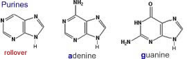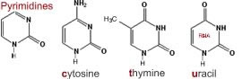\

Being single stranded removes a major constraint on the structural
diversity of RNA molecules.

Once thought of as passive transmitters of information from DNA to
protein (as messenger or mRNAs), it is now clear that RNAs play many
different functional roles within the cell, including transfer (tRNAs),
ribosomal (rRNAs), and various types of regulatory molecules (these will
be considered in later classes.)

These diverse functions are possible because RNAs (unlike double
stranded DNAs) can fold into complex three dimensional shapes. As in the
case of DNA, entropic effects will act to **minimize** the interactions
between water and the hydrophobic surfaces of the nucleotide bases, and
**maximize** the interactions between water and the hydrophilic
phosphates and sugars.

This is accomplished by folding the single-stranded RNA molecule back
upon itself, and often leads to the formation of double-stranded "stems"
that end in single-stranded “loops”. Regions within a stem that do not
base pair will bulge out.

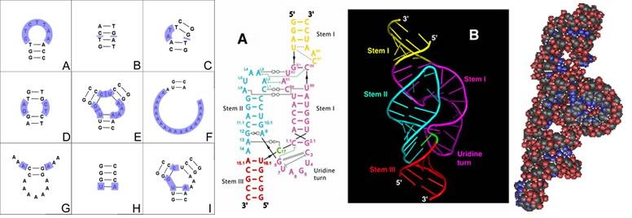

Figure: **Left** : various structural motifs found in RNA; **Center**: flat and
ribbon schematics of the structure of an RNA; **Right**: a van der Waals
surface rendering of an RNA molecule.

The ability of RNA to both encode information in its base sequence and to mediate 
catalysis through its three dimensional structure has led to the 
[RNA world hypothesis](http://www.science20.com/news_articles/rna_world_hypothesis_gets_challenge-90437).

This states that early organisms relied on RNAs, or more likely simpler
RNA-like molecules, rather than DNA and proteins, to both store genetic
information and to catalyze reactions.

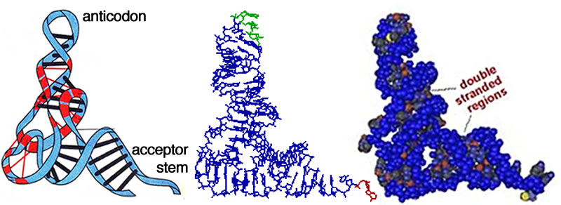

*Figure: Molecular structure of t-RNAs*
 
 According to this hypothesis, it was only later in the evolutionary
process that organisms develop more specialized DNA-based systems for
genetic information storage and proteins for catalysis and other
structural functions.

There are many unsolved issues associated with a simplistic RNA world
view, the most important being the complexity of RNA subunits and their
abiogenic synthesis and survival.

Nevertheless, it is becoming well established that catalytic RNAs play a
key role in modern cells, and early evolution as well. Take the
ubiquitous ribosome, which is involved in protein synthesis; its
catalytic activity is based on a
[ribozyme](http://users.rcn.com/jkimball.ma.ultranet/BiologyPages/R/Ribozymes.html),
a RNA-based catalyst.

* * * * *

**Questions to answer**

1.  Which do you think is stronger (and why), an AT or a GC base pair?
2.  Why does the ratio of A to G differ between organisms?
3.  Why is the ratio of A to T the same in all organisms?
4.  What does it mean that the two strands of a DNA molecule are
    anti-parallel?
5.  Normally DNA exists inside of cells at physiological salt
    concentration (\~140 mM KCl, 10 mM NaCl, 1 mM MgCl~2~ and some minor
    ions). Predict what will happen (what is thermodynamically
    favorable) if you place DNA into distilled water (no dissolved
    salts).
6.  On average, during DNA/RNA synthesis, what is the ratio of
    productive to unproductive interactions between nucleotides and the
    polymerase?

**Questions to ponder**

-   Why is DNA unstable?
-   Could organisms exist if DNA were totally stable?

* * * * *