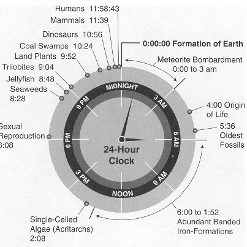
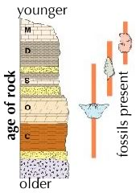
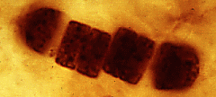
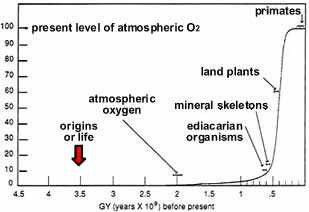
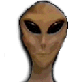
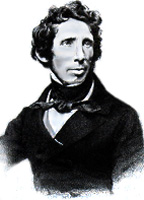
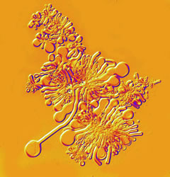

##Life’s Origins

* * * * *

**Where did the different types of organisms now living on earth come
from?**  This is one of the many fundamental questions that biology attempts
to answer. 

Did organisms arise at one specific time point, or have different types
of organisms appeared at different times during the history of earth?

It used to be [widely believed](http://www.accessexcellence.org/RC/AB/BC/Spontaneous_Generation.html)
that various types of organisms, such as flies, frogs, and even mice,
arose spontaneously, from non-living matter.

Flies, for example, were thought to appear from rotting flesh and mice
from wheat. If true, on-going spontaneous generation would have profound
implications for our understanding of biological systems.

 

*Figure: Francesco Redi was one of the first scientists to study the origins of life. Click the image to learn more*

> He who experiments increases knowledge. He who merely speculates piles
error upon error.- Arabic epigraph quoted by Redi.

A key event in the conceptual development of modern biology was the
publication in 1668 of Francesco Redi’s “Experiments on the generation
of insects”. He hypothesized that spontaneous generation did not occur
and that the organisms that appeared had developed from “seeds”
deposited by adults.

His hypothesis predicted that if adult flies were kept away from rotting
meat, for example, maggots would not appear - no matter how long one
waited. 

To test this hypothesis, Redi set up two sets of flasks - both contained
meat. One set was exposed directly to the air (and so to flies), the
other was sealed with paper or cloth. 

*Figure: Redi's experimental design. Click the image to learn more*

Maggots appeared only in the flasks open to the air. Redi concluded that
organisms as complex as insects could arise only from other insects.

* * * * *

The invention of the microscope, and its application to biological
materials by [Antony van
Leeuwenhoek](http://www.ucmp.berkeley.edu/history/leeuwenhoek.html)
(1632-1723) and [Robert
Hooke](http://www.ucmp.berkeley.edu/history/hooke.html)(1635-1703),
led to the discovery of a completely new (and totally unexpected) world
of microscopic organisms - the protozoa, microscopic fungi, bacteria,
and archaea.

<embed width="420" height="345" src="http://www.youtube.com/v/vxLdSNn9UvQ" type="application/x-shockwave-flash"> </embed>
*Movie: A single drop of pond water viewed with a microscope*

Although it was relatively easy to generate compelling evidence that
macroscopic organisms, such as flies and mice, could not arise
spontaneously, it seemed quite possible that microscopic (and presumably
much simpler) organisms might be able to form spontaneously.

> So, naturalists observe, a flea has smaller fleas that on him prey; and
these have smaller still to bite ’em; and so proceed ad infinitum. - Jonathan Swift

A number of scientists began to explore the reproduction of microbes.
Lazzaro Spallazani (1729-1799) showed that after a broth was boiled, it
remained sterile (that is, without life) as long as it was isolated from
contact with fresh air.

He concluded that microbes, like larger organisms, could not arise
spontaneously, but were descended from other microbes (a version of the
cell theory).

One criticism of this experiment was that perhaps the process of boiling
the broth destroyed some vital component necessary for the formation of
microbes, or perhaps fresh air was the “vital” ingredient.

In 1862, Louis Pasteur carried out a particularly convincing set of
experiments to address these concerns. He sterilized broths by boiling
them in special “swan-necked” flasks.

*Figure: Pasteur's Exerimental Design. Click the images to view the tutorial, "Experimentation in practice:investigating the spontaneous generation of life"*

The flask was open to the air but because of the shape of its neck,
airborne organisms could not reach the broth. The liquid remained
sterile for months. Once the neck of the flask was broken, however, the
broth was quickly overrun with microbial growth. 

Based on such experiments, a consensus was reached that neither
microscopic nor macroscopic organisms could arise spontaneously, at
least in the modern world.

Because of this scientific consensus, studying spontaneous generation
was no longer considered a productive way to advance one’s career in
science.

* * * * *

**Questions to answer:**

1. What evidence (do you think) lead people to propose the hypothesis of spontaneous generation?
2.  Why did the discovery of bacteria reopen the debate on spontaneous
    generation?
3.  What were the [positive and negative controls](http://en.wikipedia.org/wiki/Scientific_control) in Pasteur’s
    experiment?

**Question to ponder:**

1.  How would biology change if spontaneous generation were occurring
    today, for example, between your toes?
2. Is their any evidence to support the hypothesis of spontaneous generation? 

* * * * *

**The origins of life in the universe: **

Where did the first organisms come from? To begin to address this
question, it is best to start at the beginning.  The current scientific
model for the origin of the universe is known as the "[Big
Bang](http://en.wikipedia.org/wiki/Big_Bang)" theory. 

 

*Figure: The Big Bang. Click the image to read more about the origins of the universe*

[Edwin Hubble](http://www.pbs.org/wgbh/aso/databank/entries/bahubb.html)
(1889-1953) was the first to realize that the fuzzy nebula that
astronomers saw through their telescopes were in fact galaxies, like our
own [Milky Way](http://antwrp.gsfc.nasa.gov/apod/ap050825.html).  Each
was composed of many millions of stars.

These galaxies appeared to be moving away from one another. He concluded
that at one point in the past, all of the matter and energy in the
universe must have been concentrated in a single point.

<embed width="420" height="345" src="http://www.youtube.com/v/_mZQ-5-KYHw" type="application/x-shockwave-flash"> </embed>
*Movie: The Big bang explained*

Based on this hypothesis, it is possible to estimate the [age of the
universe](http://map.gsfc.nasa.gov/m_uni/uni_101age.html) at [13.7 +/-
0.2](http://www.astro.ucla.edu/%7Ewright/age.html) billion (10^9^)
years. This is a length of time well beyond human comprehension; it is
sometimes referred to as [deep
time](http://www.handprint.com/PS/GEO/time9.html).

The earth and the other planets formed \~ 4.5 x 10^9^years ago. The
earliest period of earth history is known as the Hadean, after
[Hades](http://www.pantheon.org/articles/h/hades.html), the Greek god of
the dead. The Hadean is defined as the period before the appearance of
life. The first evidence of biological processes appear in rocks that
are \~3.8 to 3.5 x 10^9^ years.

We do not know how many times life arose on the early earth, all we do
know is that all of the current organisms we have studied are descended
from a single common ancestor.

* * * * *

<embed width="420" height="345" src="http://www.youtube.com/v/l1a12go43_0" type="application/x-shockwave-flash"> </embed>
*Movie: Evolution explained by Bozos*

**Evidence of life:** Fossils provide the most dramatic evidence of the
history of life on earth. Fossils are formed only in [sedimentary
rock](http://en.wikipedia.org/wiki/Sedimentary_rock).

Chemical fossils are molecules that, as far as we know, occur
naturally only through biological processes. Their presence in ancient
rock implies that living organisms were present at the time the rock was
formed. What makes chemical fossils problematic is that there may be
non-biological mechanisms that could produce them, but which we have yet
to discover.

Trace fossils can be subtle or obvious.  Burrowing animals can leave
[tunnels and disrupt layers of
sediment](http://www.geo.ucalgary.ca/%7Emacrae/t_origins/carbbones/burrow.html). 
Animals that walk can leave footprints.

 

*Figure: Fossilized dinotracks at Dinosaur Ridge, in Morrison, Colorado. Click the image to read more.*

Organisms without hard parts, such as
[jellyfish](http://www.fossilmuseum.net/Fossil_Sites/Amazing_Cambrian_Quarry_in_Wisconsin/Amazing_Cambrian_Quarry_in_Wisconsin.htm),
can leave impressions, much like footprints.

Structural fossils are the mineralized remains of organisms. More often
than not a dead organism is eaten, and nothing recognizable remains.

Occasionally an organism’s remains are buried before they are destroyed.
This can lead to fossilization, which involves replacing the organic
materials with minerals. The biological material becomes stone. Over the billions of years that life has
existed on earth, many fossils have been created; as erosion removes
surface layers of rock, these fossils come to light.

A fossil can be as simple as a single tooth, scale or shell, or as
complex as a complete skeleton. As organisms developed hard parts, such
as bones, teeth, and shells, fossilization became more likely. 

Fossils of various types suggest that the first living microbes were
present on earth by \~3.5 x 10^9^ years ago, and perhaps earlier. 

]

 *Figure: Fossil strata. Click the image to learn more*

**Change over time:** Early on in the history of geology, it was
discovered that fossils of specific types were found associated with
rocks of specific ages - this correlation was so robust, that rocks can
be accurately dated by the types of fossils they contain.

The oldest rocks contain the fossilized remains of only very simple
organisms. 

*Figure: Fossilized bacteria. Click the image to learn more*

* * * * *

**Life’s impacts:**

Based on fossil evidence, it would appear that for a period of \~2 x
10^9^ years, microscopic organisms were the only form of life on earth.

During this period, photosynthetic
[bacteria](http://www.ucmp.berkeley.edu/bacteria/cyanointro.html)
captured light and used that energy to drive the reaction by which CO~2~
(carbon dioxide) and H~2~O (water) are combined to form sugars
(carbohydrates), a process known as [photosynthesis](http://en.wikipedia.org/wiki/Photosynthesis).

In the course of these reactions molecular oxygen (O~2~) was produced as
a waste product. Over time O~2~ began to accumulate in the atmosphere.
By about 300 million years ago, atmospheric O~2~ levels had reached
\~35%, almost twice the current level. 

*Figure: Atmospheric oxygen levels have changed over time*

Some hypothesize that it was these [high levels of
atmospheric](http://www.learner.org/courses/envsci/unit/text.php?unit=1&secNum=6) O~2~
that made possible the evolution of giant flying insects. Indeed there are fossilized remains of [dragon flies](http://en.wikipedia.org/wiki/Meganeura) that had wingspans of 65 cm (~25.6 inches)

Because O~2~ is a highly reactive and potentially toxic compound, its
appearance posed challenges and provided opportunities to many
organisms.

For example, through coupled reactions O~2~ can be used to extract the
maximum amount of energy from food, leading to the generation of CO~2~
and H~2~O. A process known as [cellular respiration](http://en.wikipedia.org/wiki/Cellular_respiration)

Around 10^9^ years ago [trace fossil
burrows](http://palaeo.gly.bris.ac.uk/Palaeofiles/Cambrian/controversies/recent/recent.html)
appeared; these were likely to have been produced by simple worm-like,
macroscopic (meaning larger) metazoans (meaning multicellular animals)
moving along and through the mud on the ocean floor. 

About 600 x 10^6^ years ago, new, more complex structural fossils begin
to appear in the fossil record. The first of these were the Ediacaran
organisms. It remains unclear how they are related to later organisms. 

*Figure:Edicarian Fossil: Click the image to read more.*

By the beginning of the Cambrian age (545 x 10^6^ years ago), a wide
variety of organisms had appeared, many clearly related to modern
organisms. 

These Cambrian organisms show a range of body types.  Most
significantly, many were armored, suggesting the value of adaptations
against predators. 

Since the fossil record does not contain all types of organisms, we are
left to speculate on what the earliest metazoans looked like.

* * * * *

**Questions to answer**

1.  How do scientists estimate the age of the universe?
2.  What factors would influence the probability that a particular
    organism, or type of organism, would be fossilized? 
3.  What factors might have driven the appearance of teeth, bones, and
    shells?
4.  How would biology change if fossils of complex organisms (such as
    vertebrates) were to be found in the most ancient of rocks?  
5.  Propose a model for why O~2~ levels have changed so dramatically
    over the course of earth’s history.

**Questions to ponder**

-   If life first arose \~3.5 x 10^9^ years ago, why did it take so long
    for complex multicellular organisms to form?
-   What would evidence for pathogens (disease-producing organisms) look
    like in the fossil record?

* * * * *

**Understanding origins**: There are at least three possible approaches
to the study of life’s origins. A **religious** (i.e. non-scientific)
approach postulates that life was created by a supernatural being or
process.

Different religious traditions differ as to the details of this event,
but since the process is supernatural it cannot, by definition, be
studied scientifically. 

Nevertheless, “intelligent design” creationists claim that we can
identify those aspects of life that could not have been produced by
natural processes, by which they mean the processes of evolution. This
approach abandons science, and displays a failure of faith in the
creative power of natural processes, as well as in our ability to
discover and understand them. 

More significantly, it implies that the origins of life are, by
definition, beyond the ability of science to study. The lesson of
history, however, is different. Predictions as to what is “beyond the
ability of science to explain” have consistently been demonstrated to be
wrong, often only a few years after they are made!

* * * * *

Another type of explanation would be to assume that advanced aliens
brought life to earth. This hypothesis is termed
[panspermia](http://en.wikipedia.org/wiki/Panspermia). Perhaps we owe
our origins to casually discarded litter from alien visitors.  

*Figure: Aliens. Click the image to read more about panspermia*

Unfortunately, this does not really answer the question of how life
began, since those aliens also had to come from somewhere. 

If there is life on other planets, and we could analyze it, it would be
extremely informative to know how similar it is to life on earth. Are
the same types of molecules used? Is DNA used to store genetic
information?  If it is very different, would we even recognize it as
being alive? 

Unfortunately, it is currently not yet possible (and unlikely to become
possible) to answer these questions.  While “earth-like” planets
continue to be discovered, we really have no idea whether life is common
or rare ([in the universe](http://en.wikipedia.org/wiki/Fermi_paradox)).   

The most likely scenario for discovering independent origins of life
would be to look at planets and moons in our [solar system.](http://www.wired.com/wiredscience/2009/01/et-life/) ([Darwin IV alien planet video](http://www.youtube.com/watch?v=BNLfNe12BKE&feature=related)). 

* * * * *

**The death of vitalism:** It was originally thought that life itself
was a type of supernatural process, too complex to obey (or be
understood through) the laws of chemistry and physics.  

In this “vitalistic” view, organisms were thought to obey different laws
from the “non-living” world. For example, it was widely held that the
molecules found in living organisms, known as organic molecules, could
not be made except by living organisms.  

This view was challenged when Friedrich Wöhler (above) synthesized urea in the
lab in 1828. 

Urea is a simple organic molecule. O=C(NH~2~)~2~. It is naturally
found only in living organisms and is a major waste product. 
[Urine](http://en.wikipedia.org/wiki/Urine) contains lots of urea. 

Wöhler’s [*in vitro*](http://en.wikipedia.org/wiki/In_vitro) synthesis of urea was simple. He took
the inorganic compound ammonium cyanate (NH~4^+^~CNO^-^) and heated it;
this led to the production of
[urea](http://www.3rd1000.com/urea/wohler.htm). 

While simple, the synthesis of urea had a profound impact – it revealed
that there was nothing supernatural about the synthesis of urea; it
obeyed the laws of chemistry.

Based on this and similar observations, we (that is, scientists) are now
comfortable with the idea that all molecules in cells can, in theory at
least, be synthesized outside of cells, using the appropriate
procedures. 

This is very much the same approach that scientists use when they
consider the question of how life first arose.  

They assume that life is a natural process, and that with time, the
steps involved could be recapitulated in the lab. 

> It is often said that all the conditions for the first production of
living organisms are now present.  But if (and oh! what a big if!) we
could conceive in some warm little pond, with all sorts of ammonia and
phosphoric salts, light, heat, electricity, etc. present, that a
proteine compound was formed, ready to undergo still more complex
changes, at the present day such matter would be instantly devoured or
absorbed, which would not have been the case before living creatures
were formed. - Charles Darwin (1887).

One approach to understanding what is involved in the origin of life is
to attempt to create the precursors of living systems in the laboratory.
An early and influential example of this approach was the [Miller-Urey
experiment](http://www.chem.duke.edu/%7Ejds/cruise_chem/Exobiology/miller.html).

These two scientists made a guess as to the composition of earth’s early
atmosphere. They assumed the presence of oceans and lightning. 

They set up an apparatus to mimic these conditions. They passed
electricity through their experimental atmosphere.  

 

After awhile (hours/days), they found that a complex mix of compounds
had formed. Included in this mix were many different types of amino
acids. Amino acids are the building blocks of proteins, a major component of living cells.

Certain types of meteorites also contain complex organic molecules. It
therefore appears likely that the early earth was rich in organic (that
is, carbon-containing) molecules, the building blocks of life.

Given that the potential building blocks were present, the question is,
what set of steps were involved in generating living systems? The
earliest proto-biotic systems were likely to be molecular communities of
chemical reactions isolated in some way from the rest of the “outside”
world. 

One possible model is that such systems were originally associated with
the [surface of specific
minerals](http://www.spacedaily.com/news/life-04zc.html), which served
as catalysts for important reactions.

*Figure: Primitive lipid membranes, perhaps like those that were associated with early life. Click the image to learn more*

Over time, these systems acquired membranes and were able to exist free
of the mineral surface. 

Such an isolated system has important properties that are likely to have
facilitated the further development of life.  

For example, because of the membrane boundary, changes that occur within
one such structure will not be “shared” with neighboring systems, they
can accumulate and favor the “survival” of one system over its
neighbors. 

Such systems can also “divide” in a crude way by fragmentation.  If
changes within one such system improves its stability, its ability to
accumulate resources, or its ability to survive and reproduce, that
system, and its progeny, are likely to become more common.

As changes accumulate, and are passed from parent to offspring, the
“organisms” will evolve. 

> [Scientists now believe they may be able to make very simple ‘artificial
cells’ which can metabolize, replicate and evolve. - Jack
Szostak](http://online.itp.ucsb.edu/online/evonet07/szostak/)

* * * * *

**Questions to answer**

1.  What are the properties of life? 
2.  What did Wohler’s synthesis of urea and the Miller-Urey experiment
    actually prove, versus what did they imply?
3.  How did Wohler’s experiment change the meaning of the term
    “organic”?  
4.  If thermodynamics tells us that systems become more disordered over
    time (the [second law of thermodynamics](http://en.wikipedia.org/wiki/Second_law_of_thermodynamics)), does life speed up or slow down this process?
5.  Does life obey or disobey the second law of thermodynamics?

**Questions to ponder**

-   What would it take for you to consider a computer to be alive?
-   How is the idea of  “vitalism” similar to “intelligent design
    creationism”?  How is it different?

* * * * *