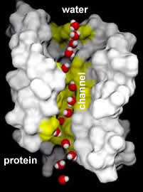

##Carriers, Pores, and Pumps##
* * * * * 
Biological (lipid-based) membranes pose a significant barrier to the movement of hydrophilic molecules (do you know why?). To overcome this barrier, ions and other hydrophilic molecules, such as sugars and amino acids, pass through membranes in association with and iaded by various types of molecules, most of which are proteins.

Never fear, we will discuss the basics of proteins later in the course!

-   **Carrier** molecules shuttle back and forth across the membrane with their "cargo." Hydrophilic molecules are picked up on one side of the membrane and released on the other. Each carrier is specific for a certain type or class of molecule.

-   **Channel** (or pore) proteins sit within the membrane. They contain an aqueous channel as an integral part of their structure. Hydrophilic molecules of the right size and shape can diffuse through this channel. In many cases, whether a channel is open or closed can be regulated; they can be turned on and off.

-   **Pump** proteins use energy (through coupled chemical reactions) to actively move various types of molecules across the membrane, often against a concentration gradient.
 

> *Movie: Click on the image to watch the tutorial: Moving through biological membranes*

Hydrophobic molecules have a different problem. They are insoluble in water.

To move around the body they are often bound to water soluble carrier proteins outside of the cell. They can be released into the membrane and pass through it. They can then be removed from the membrane by binding to water soluble carrier proteins in the cytoplasm.

____

**Aquaporins and their relatives**: The size of molecules that a channel protein can transport is determined by the shape and charges associated with the channel within it.

There are a number of different types of channels in the membranes of cells.

One perhaps surprising group of proteins are the [**aquaporins**](http://www.vivo.colostate.edu/hbooks/molecules/aquaporins.html). These and related proteins act as water channels.

> *An aquaporin. Click the image to see an animation of these water channels work!*

They increase the permeability of the membrane to water and other small hydrophilic molecules.

In fact, in the absence of aquaporins, the rate of osmotic movement of water is dramatically reduced. 

Aquaporins appear to be [present in all organims](http://www.ncbi.nlm.nih.gov/pubmed/11443343?dopt=Abstract) (excluding bacteria and monera) and to play a [critical physiological role](http://www.ncbi.nlm.nih.gov/entrez/query.fcgi?cmd=Retrieve&db=pubmed&dopt=Abstract&list_uids=15548852). 

* * * * *

**Membrane structure and temperature:** The proteins that form the
channels and pumps within the membrane can, in fact, float within the
plane of the membrane.

This allows them to move from place to place, and to interact with one
another.

But to move, the membrane must be "fluid", that is the lipid molecules
must be able to move more or less freely in the plane of the membrane.

The molecular dynamics and behavior of a lipid bilayer changes with
temperature. At low temperatures the lipid tails pack closely with one
another. The energy from collisions with other molecules is not enough
to knock them apart. The membrane is said to be "solid".

This is analogous to a phase change (solid to liquid, liquid to vapor).
Where a phase change occurs is a function of the potential energy
associated with intermolecular interactions (E~P~), which itself is a
function of how molecules interact with one another and is strongly
influenced by molecular shapes, and the kinetic energy (E~K~) which is a
function of temperature and reflects the energy available through
molecular collisions.

> *Movie: Click on the image to watch the tutorial: Melting membranes and molecular movement*

Proteins embedded in a membrane below the "melting temperature" are
stuck in position.

As the temperature increases, the membrane melts. The lipid tails become
increasingly disordered.

**Membrane fluidity** is critical for the functioning of many membrane
proteins.

* * * * *

Cells can control membrane fluidity by regulating the lipid composition
of the membrane. In particular, lipids can have hydrocarbon chains that
are saturated or unsaturated, and the amount of cholesterol in the
membrane also influences membrane melting behavior. In human cells,
between 30 to 40% of the lipids, by number, are cholesterol molecules.
The bulky shape of the cholesterol molecule suppresses membrane
freezing.

In saturated hydrocarbon chains, the carbons are linked by single bonds.
The hydrocarbon chain is flexible, but more or less straight.

In unsaturated hydrocarbon chains, some of the carbons are linked by
double-bonds.

When a lipid is dehydrogenated, hydrogens are removed and **-C=C-**
bonds are formed.

The presence of a **-C=C-** bond leads to a kink in the hydrocarbon
chain. Kinked chains cannot pack together as regularly as can straight
(saturated) hydrocarbon chains.

Compare the saturated fatty acid stearic acid to the unsaturated fatty
acid oleic acid.

Both have the same number of carbons in their hydrocarbon chains. While
stearic acid melts at 69°C oleic acid melts at 13°C.

* * * * *

**Questions to answer:**

1.  Why do membrane lipids solidify at low temperature? How are van der
    Waals interactions involved? Are H-bonds involved?
2.  Draw a schematic of the plasma membrane, indicate where cholesterol
    molecules are located?
3.  Why does the presence of unsaturated bonds in the lipid chain alter
    the temperature at which the membrane solidifies?
4.  Predict (and justify) the effect of changing the position of a
    double bond in a hydrocarbon chain on the temperature of
    solidification?

**Questions to ponder**

-   Would a membrane be more permeable to small molecules at high or low
    temperatures and why?

* * * * *

**Coupling concentration gradients:** Whether or not there will be a
**net** movement of a molecule across a membrane depends upon a number
of factors.

**First**, the molecule must be able to pass through the membrane - the
membrane must be permeable to it.

**Second**, the concentration of the molecule on one side of the
membrane must be higher than the concentration on the other; such a
difference in concentration between two places is known as a
concentration gradient. There is, of course, an exception where "protein
pumps" and coupled chemical reactions are involved, which we will
discuss below.

If **[molecule]**~outside~ equals **[molecule]**~inside~, there will be
no **net** movement of molecules across the membrane

The system is in equilibrium, meaning that there is no net change over
time and no energy is used by the system. This does not mean that the
system is static; molecules **are moving** back and forth through the
membrane, but there is no net flux.

If **[molecule]**~outside~ is not equal to **[molecule]**~inside~ there
will be a net flux of molecules from the region of higher concentration
to the region of lower concentration. This flux is driven by the energy
stored in the concentration gradient.

Note, our analysis of net flux assumes that there are proteins present
in the membrane that act as channels.

There exist other classes of transporters. Co-transporters come in two
"flavors", **symporters** and **antiporters**. Both transport two
different types of molecules through a linked mechanism.

Symporters transport two molecules together in the same direction.
Examples are the Na^+^/galactose and
[Na^+^/I^+^](http://arbl.cvmbs.colostate.edu/hbooks/pathphys/endocrine/thyroid/nai_symport.html)
symporters

Antiporters, such as the GlpT glycerol-phosphate/phosphate transporter
moves molecules (glycerol phosphate and phosphate) in opposite
directions.

Using symporters or antiporters, it is possible to couple different
concentration gradients, so that the flux of one type of molecule down
its concentration gradient can be used to move another type of molecule
up its concentration gradient.

  --
  --

Basically, a concentration gradient of one molecule acts as a source of
energy (a battery) to drive the movement of the other.

If there were no membrane, or if the membrane were completely and freely
permeable, this "battery" would run down very fast.

  --
  --

* * * * *

**Pumping up gradients:** If a membrane were completely impermeable, the
concentration gradients across the membrane would remain stable. On the
other hand, it would not be possible for the cell to use the energy
stored in these concentration gradients.

Real biological membranes are semi-permeable; they can be used both to
store and access energy. The movement of different molecules across them
differ based on which transport proteins are present and active.

Because they are semi-permeable, biological membranes leak - without the
constant addition of energy, the energy stored in concentration
gradients across a membrane would dissipate over time, that is

**[molecule]**~outside~ will become equal to **[molecule]**~inside~.

Generating and maintaining concentration gradients requires the
expenditure of energy.

Membrane proteins that directly use energy to generate or maintain
concentration gradients are known as pumps. These are complex protein
machines - some can capture energy directly from light, others use
chemical energy.

  --
  --

There are a number of molecules used to store and transfer chemical
energy in biological systems.

Perhaps the most important is
[ATP](http://www.bris.ac.uk/Depts/Chemistry/MOTM/atp/atp1.htm).

Because ADP and phosphate are more stable than ATP + water, the ATP
hydrolysis reaction is thermodynamically favorable, and can (through
reaction coupling) be used to drive thermodynamically unfavorable
reactions.

In the ATP hydrolysis reaction (ATP + H~2~O to ADP + Pi), the bond
between the terminal or γ (gamma) phosphate group of ATP is broken and
new, more stable bonds are formed.

  --
  --

The ATP hydrolysis reaction is coupled to the reaction that changes the
structure of the pump protein; this drives a change in the structure of
the pump protein and the pumping of molecules across the membrane (A~in~
to A~out~).

* * * * *

Questions to answer

\

1.  When would a carrier protein release a bound (hydrophobic) molecule?
2.  Why does an aquaporin channel not allow a Na+ ion to pass through
    it?
3.  If there is no net flux of A, even if there is a concentration
    gradient between two points, what can we conclude?
4.  What happens to the movement of molecules through channels and
    transporters if we reverse the concentration gradients across the
    membrane?
5.  What makes a biological membrane semi-permeable?
6.  Why do we need to add energy to maintain gradients?
7.  Which (and why) would you think would transport molecules across a
    membrane faster, a carrier, a channel, or a pump?
8.  Would it be possible to capture all of the energy associated with
    ATP hydrolysis? [What "law" might get in the
    way](http://hyperphysics.phy-astr.gsu.edu/hbase/thermo/seclaw2.html#c2)?

Questions to ponder\

-   In considering the evolution of wall-less organisms, how might the
    expression of aquaporins be important?
-   What does it mean to move up a concentration gradient?
-   Are there molecules that can move up their concentration gradients
    spontaneously?

* * * * *

[ talk amongst yourselves about the questions]

* * * * *

  --
  --

* * * * *

revised 24-Apr-2013

