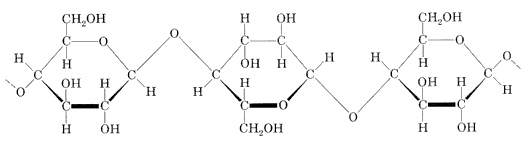
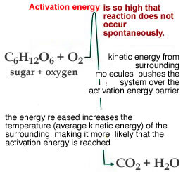
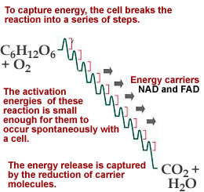
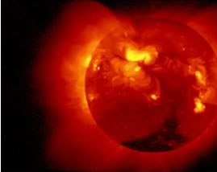
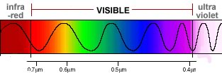
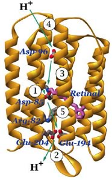
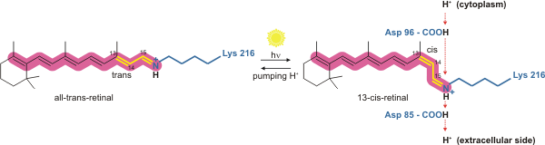
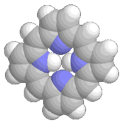

##Capturing energy

* * * * *

Organisms use energy to build complex and unstable biological molecules,
maintain their structural organization (for example, maintain chemical
gradients across their membranes), and to build copies of themselves.

There are two sources of energy available to organisms: chemical and
electromagnetic.

When you consider molecules, you will realize that biologically useful
energy is held in molecular electron orbitals; there are no nuclear
reactions going on inside cells.

The structure of a molecule’s electron orbitals determines the amount of
energy stored in each electron. When an electron is added to a molecule
the energy of the molecule increases and the molecule is said to have
been “reduced”.

](./img/redOx1.gif)

And yes, it does seem weird that adding an electron “reduces” a
molecule.

If an electron is removed, the molecule’s energy is lowered and the
molecule is said to have been “oxidized”.

Since electrons can neither be created nor destroyed (remember, no
nuclear reactions), the reduction of one molecule is always coupled to
the oxidation of another. For this reason, reactions of this type are
referred to as [redox
reactions](http://naio.kcc.hawaii.edu/chemistry/basic_model.html).

There are many compounds in the natural world from which organisms can
extract energy. Lithotrophs or [rock
eaters](http://www.bact.wisc.edu/microtextbook/Metabolism/lithotrophs.html)
extract energy from inorganic compounds, such as elemental sulfur (S),
molecular hydrogen (H~2~), and methane (CH~4~).

Most higher organisms (like plants, fungi, and animals) are either phototrophs, which extract energy from
light, or chemoorganotrophs, which extract energy from organic
molecules. You yourself are a chemoorganotroph.

The larger the change in free energy (ΔG) associated with a reaction,
the more energy is released or absorbed when the reaction occurs. 

Consider wood, which is mainly composed of the carbohydrate polymer
cellulose [C**~6~**H**~10~**O**~5~**]**~n~**

The burning of wood can be written as a chemical reaction. cellulose +
O~2~ ↔ nCO~2~ + nH~2~O**\
**

*Figure: Cellulose is a polymer of glucose (sugar)*

This reaction has a high negative free energy ( ΔG), it is exothermic.
That means, the energy stored in the bonds of cellulose and O~2~ is less
than that stored in the bonds of CO~2~ and H~2~O. The difference is
released as heat (thermal motion, that is increased kinetic energy).

At the same time, the activation energy of this reaction is high, which
is why books do not spontaneously burst into flames. While
thermodynamically favorable (because ΔG is negative), it does not occur
spontaneously (at least if we use the word spontaneously as it is
normally used in English).

Once started, however, the energy released during the reaction acts to
maintain the reaction – the reaction becomes self-sustaining and
continues until the reactants are used up.

In order to be biologically useful, however, highly exothermic reactions
must be controlled and the energy released must be captured in a useful
form. It is hard for an organism to capture, at the molecular level, the
energy of a fire.

To capture energy, cells use step-by step processes. As an example, a
molecule of sugar is broken down by a cell in a tightly controlled,
[step-by-step
process](http://en.wikipedia.org/wiki/Glycolysis) known as
glycolysis, from the Greek words meaning sweet (glyco) and splitting
(lysis).

The energy released is captured through synthesis of a number of
unstable compounds, including ATP.

* * * * *

Phototrophs, organisms that extract energy from light, capture [light
particles](http://scienceworld.wolfram.com/physics/Photon.html)
(photons) and transform their electromagnetic energy into chemical
energy.

Generally they store this energy in concentration gradients across
membranes or in relatively unstable molecular bonds.

One of the simplest methods for capturing light and transforming it into
chemical energy is used by the archaea
*[Halobacterium halobium](http://en.wikipedia.org/wiki/Halobacterium)*.
Halobacteria are extreme halophiles or salt-loving archaea that live in
waters that contain up to 5M NaCl. (Saltwater in the ocean is /~0.6 M NaCl)

Our atmosphere allows mainly visible light from the sun to reach the
earth’s surface.

Most biological molecules, however, do not absorb visible light.
Organisms must therefore use special molecules, known as pigments, to
capture visible light.

* * * * *

Light acts as both a wave and a particle (that is quantum physics for
you!) The wavelength of a photon determines its color and the amount of
energy it contains.

A pigment’s color is due to the photons it does not absorb. These are
reflected and can be seen by an observer.

To absorb light, *H. halobium* uses a membrane embedded protein,
bacteriorhodopsin.

Bacteriorhodopsin consists of two components, a protein, known
generically as an **opsin**, and a non-protein prosthetic group, the
pigment **retinal**, a molecule derived from [vitamin
A](http://www.ch.ic.ac.uk/vchemlib/mim/bristol/retinal/retinal_text.htm).

When a photon of light is absorbed by the retinal group, it undergoes a
photoisomerization reaction

[*A ribbon diagram of bacteriorhodopsin.*](http://en.wikipedia.org/wiki/Bacteriorhodopsin) 
 
This is a light-induced change in the molecular configuration of the
pigment molecule.

It leads to a change in the pigment molecule’s shape and composition.

This light-induced change leads to a change in the structure of the
polypeptide to which the retinal group is attached.

The protein itself is embedded within the plasma membrane so that the
light-induced change in protein structure results in the movement of a
H^+^ ion across the membrane and out of the cell.

Because all of the bacteriorhodopsin molecules are oriented in the same
way in the membrane, as light is absorbed, a H^+^ concentration gradient
is generated across the plasma membrane.

This H^+^ gradient is subsequently tapped by a second membrane protein,
ATP synthase to synthesize ATP and water from ADP and phosphate. When
the light goes off, the H^+^ gradient dissipates, and the light-driven
synthesis of ATP synthesis slows and stops.

<embed width="420" height="345" src="http://www.youtube.com/v/Lno68LiPBSU" type="application/x-shockwave-flash"> </embed>

*Tutorial: Transforming light -- bacteriorhodopsin*

* * * * *

<embed width="420" height="345" src="http://www.youtube.com/v/4OkN1QC4hyY" type="application/x-shockwave-flash"> </embed>

http://www.youtube.com/watch?v=4OkN1QC4hyY&feature=player_embedded*

Tutorial: Gradients and reactions -- bacteriorhodopsin*

<iframe width="420" height="315" src="//www.youtube.com/embed/d5fDEUhjo-M" frameborder="0" allowfullscreen></iframe>

* * * * *

**Other photosystems:** Cyanobacteria and plants use a more complex
(homologous) system to capture and utilize light. The major pigments in
this system, the chlorophylls, are based on a complex molecule, a
[porphyrin](http://www.washburn.edu/cas/chemistry/sleung/porphyrin/porphyrin_page.html).

*Figure: A porphyrin ring. Click the image to learn more*

They absorb visible light due to the presence of a resonance structure
(typically drawn as a series of single and double) carbon-carbon bonds.
This actually a over-simplifies what the molecule looks like; these
bonds are more like one and a half bonds (this is known as a resonance
structure, but the chemistry is beyond us here).

It is these pigments that give plants their [green
color](http://users.rcn.com/jkimball.ma.ultranet/BiologyPages/C/Chlorophyll.html).

Chlorophyll molecules are organized into two distinct protein complexes
that are embedded in membranes: these macromolecular complexes are known
as the light harvesting and reaction center complexes.

Light harvesting complexes act as antennas to increase the amount of
light the organism can capture. This is important because photosynthetic
organisms often compete with one another for light.

A photon absorbed by a light harvesting complex leads to the excitation
of an electron. The antennal system is highly organized and passes this
excited (high energy) electron to a specialized protein-chlorophyll
complex, the reaction center.

From the reaction center, the high energy electron is passed to a
membrane-bound, electron transport chain.

As the high energy electron moves through the electron transport chain,
it loses energy.

Some of this energy is used to move H^+^s across the membrane and so
generate a H^+^ concentration gradient, which in turn is used to break
the bonds of ADP and inorganic phosphate (Pi) and generate ATP and
H~2~O.

In this cyclic reaction, a low energy electron is returned from the
electron transport chain to the reaction center.

<embed width="420" height="345" src="http://www.youtube.com/v/fz8AstaQDls" type="application/x-shockwave-flash"> </embed>

*Tutorial: Photo-phosphorylation. Making ATP with light*

* * * * *

The cyanobacteria and the green plants, developed a more complex light capturing system that could produce both ATP and a more stable form of stored energy, carbohydrate - which has the generic formula (CH~2~0)~n~ (carbon + water).

This system uses two coupled photosystems I and II.

In contrast to the cyclic system, this is a non-cyclic system in which
electrons are fed into the system, excited by photons absorbed by the
photosystems, and then use to reduce NADP, a phosphorylated form of the
molecule NAD^+^, to form NADPH.

The reduced NADPH is then used in a series of coupled reactions to
synthesize of carbohydrate from CO~2~ and H~2~O according to the formula

6H~2~0 + 6CO~2~ + energy (NADPH)

C~6~H~12~O~6~ + 6O~2~.

Now you might be wondering, where are the electrons coming from in
non-cyclic photosynthesis?

During the photosynthetic process, photosystem II couple light
absorption with 
[oxidation of water molecules](http://www.ncbi.nlm.nih.gov/pmc/articles/PMC1693055/). Four
electrons, derived from two molecules of water, pass to the reaction
center, 4H^+^s are also released and contribute to the proton gradient
across the membrane.

O~2~ is a waste product of this reaction. As we will see, O~2~ is
essential for many organisms, particularly larger eukaryotes like us.

**Photosynthesis** refers specifically to the reaction by which CO~2~
and H~2~O are used to synthesize carbohydrates, generally the sugar
glucose. Photosynthesis is glycolysis run backward, a reaction driven by
energy derived from absorbed light.

ATP and NADPH are produced in the presence of light; so this part of
photosynthesis is known as the light reaction.

The fixation of CO~2~ and H~2~O into carbohydrate can occur in the dark,
at least until the ATP and NADPH run out, and it is known as the dark
reaction.

*Figure: Photosynthesis*

* * * * *

**Questions to answer**

1.  Why is the burning of wood self-sustaining?
2.  Why does the H^+^ gradient across the membrane dissipate when the
    light goes off? What happens to the rate of ATP production?
3.  What would happen if bacteriorhodopsin molecules were oriented
    randomly within the membrane, some pointing one way, some the other?
4.  Does the bacteriorhodopsin create H^+^s, and if not, where do they
    come from?
5.  What is a photoisomerization? Is this a reversible or an
    irreversible reaction?
6.  How (do you suppose) does an electron move through an electron
    transport chain? Make a graph that describes its energy as it moves
    through the chain.
7.  In non-cyclic photosynthesis, electrons are extracted from what
    molecule and where do they end up?

**Questions to ponder**

1.  Why are oxidation and reduction always coupled?
2.  Why are carbohydrates good for storing energy?
3.  What else are carbohydrates used for by plants? (any ideas?)
4.  If “photosynthesis is glycolysis run backward”, why does glycolysis
    not emit light?

* * * * *