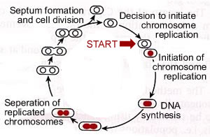

###Cell growth & division

* * * * *

Perhaps the most characteristic feature of life is the ability to
replicate, to make copies of itself. 

During the process of cell division, the genetic material must be
replicated.  The two strands of the DNA molecule separate locally, and
each serves as a template for generating a new strand.  

Changes in the DNA that accumulate prior to, or which occur during
replication, are passed on to the daughter cells. These daughter cells
are built using energy and matter captured from the environment. 

If we inoculate a culture with a few bacteria, within a few hours they
will have transformed components of the medium into millions of copies
of themselves.

When we look at these cells with a microscope, we find that they do not
grow haphazardly.

They appear remarkably uniform in both size and shape.  Different types
of cells have characteristic shapes and sizes.

They grow to a certain size and then divide.

<embed width="420" height="345" src="http://www.youtube.com/v/KskuslqGtY8" type="application/x-shockwave-flash"> </embed>

Video: Dividing bacteria

Cells monitor and control their size.  For example, consider the single
celled eukaryote, *Amoeba proteus* – these organisms divide only after
they have grown to a characteristic size.

Using microsurgical methods, it is possible to keep cells small by
simply repeatedly cutting off parts of the cell.  After the cell heals,
it grows.

If you do this repeatedly, the cell grows but never divides.  This type
of experiment argues that the cell does not use time to decide to
divide, but rather size. *[These studies were carried out by David
Prescott who also used the fact that one
can experimentally remove the nucleus of these cells to show that [RNA
was made in the
nucleus](http://www.jstor.org/discover/10.2307/1603456?uid=3739568&uid=2129&uid=2&uid=70&uid=4&uid=3739256&sid=47699112132737)!]*

How does the cell know when it has reached the correct size, how does it
know when to divide?

Studies on yeasts (unicellular eukaryotes) have identified mutations
that lead to cells that are consistently larger or smaller than the
usual, or wild type phenotype. The ability to find such mutations
implies that an active, genetically encoded system controls when cells
divide.

* * * * *

**Bacterial cell cycles: **

The replication of a cell, or an organism,
can be thought of as a cycle.  Somewhat arbitrarily, we place the
beginning of this cycle with the decision to replicate the genetic
material, the DNA.

This is a critical decision for the cell. DNA replication involves the
unwinding of the DNA and a set of highly interdependent and coordinated
processes.

Consider the following catastrophic scenario. A cell begins replicating
its DNA, but before it completes the process it runs out of resources --
ATP levels fall and the other deoxyribonucleotide triphosphates
needed to synthesize DNA are in short supply.

Under these conditions replication forks will stop and the DNA will be
left unwound and incompletely replicated.  This is a situation that is
likely to lead to DNA damage.  

To avoid this possibility, cells tightly regulate the initiation of DNA
replication.

This decision point is known as "start"; once made, the cell begins on
the path to DNA replication.

In bacteria start involves the molecular decision to build a replication
initiation complex.

The initiation complex consists of proteins that associate with a
specific DNA sequence, known as the origin of replication or origin.

There is a single **origin** in the bacterial chromosome and it acts
like a gene. In *E. coli* this gene is called **OriC**. For a DNA
molecule to replicate, it must have at least one functional origin of
replication.

In most prokaryotes, the chromosome is a circular DNA molecule.  The
origin (OriC) is where the replication bubble initiates and it is
associated with the plasma membrane. 

<embed width="420" height="345" src="http://www.youtube.com/v/NHKh08wMrM4" type="application/x-shockwave-flash"> </embed>

Video: DNA replication in cells

The two replication forks move away from one another and around the
chromosome. The forks collide in the region of the chromosome known as
the terminator region or "ter".

At the end of replication, two sister chromosomes are entangled with one
another, they are concatenated.

They are untangled by the enzyme, DNA topoisomerase II, which can pass
one double-stranded DNA molecule through another.

 
Once the replicated chromosomes are separated, the cell can be divided
into two.

A septum assembles at the center of the cell.

This molecular "purse string" is linked to the inner surface of the
plasma membrane.

As it contracts, it pulls the plasma membrane, which then pinches off to
separate the two cells.

When growing under optimal conditions bacteria can divide as fast as
once every 15 to 20 minutes.

* * * * *

**Eukaryotic chromosomes: **

As we move on to consider chromosome replication, segregation
([mitosis](http://en.wikipedia.org/wiki/Mitosis)) and cell division
([cytokinesis](http://en.wikipedia.org/wiki/Cytokinesis)) in eukaryotes,
it is important to consider the differences in chromosome structure
between eukaryotes and prokaryotes (bacteria and archaea). 

While prokaryotic chromosomes are typically circular molecules, with a
single chromosome per cell, eukaryotic chromosomes's are linear, and
there are typically many different chromosomes..

If you remember back to the mechanism of DNA replication (which is
similar in both prokaryotes and eukaryotes), lagging strand synthesis is discontinuous and requires multiple RNA primers.
This raises issues associated with complete replication of the chromosome ends. 

This problem is solved by the presence of special DNA sequences
([telomeres](http://en.wikipedia.org/wiki/Telomere)) and a specific
enzyme, [telomerase](http://en.wikipedia.org/wiki/Telomerase).  There is
a telomere at each end of eukaryotic chromosome. 

A second difference is the way replicated chromosomes are segregated to
daughter cells during mitosis.  After DNA replication, the two
replicated chromosomes remain linked together at a specific region,
known as the
[centromere](http://www.nature.com/scitable/topicpage/chromosome-segregation-in-mitosis-the-role-of-242). 
The centromere is characterized by specific DNA sequences and sequence
specific DNA-binding proteins. 

During mitosis (see below) the centromere complex interacts with the
molecular machinery that segregates the replicated chromosomes, and the
connection between the replicated chromosomes is severed during
mitosis. 

In meiosis , the centromere connection between replicated chromosomes
occurs during the second meiotic division (see next reading). 

* * * * *

**The eukaryotic cell cycle: **

The most dramatic event in the eukaryotic cell cycle, the one that
caught the eye of early microscopists, is the drastic change in nuclear
organization associated with cell division.

This process of chromosome segregation is known as mitosis. As the cell
enters mitosis, chromosomes appear as distinct bodies. 

While most prokaryotic cells have a single circular chromosome, most
eukaryotes have multiple linear chromosomes, and each chromosome has
multiple origins of replication.  Each chromosome is a single DNA
molecule.  The DNA in each chromosome must be completely replicated and
the copies segregated so that each daughter cell receives one and only
one complete copy of each chromosomal DNA molecule

The complexity of the eukaryotic cell, makes mitosis and cell division
(known as cytokinesis, more mechanically intricate than the analogous
processes in prokaryotes.  

As in the case of bacterial cells (above), eukaryotes have a cell
cycle. 

**Start** is located in the period known as the G~1~ phase of the cell
cycle; the period during which DNA synthesis occurs is known as S
phase. 

The period between the end of S and the beginning of mitosis is known as
the G~2~ phase of the cell cycle. 

Mitosis itself is known as M phase. 

The length of the cell cycle can vary tremendously, from hours to years.

Cells that are not actively dividing are said to be in G~o~. Some cells
enter G~o~ and never divide again – these cells are said to be
terminally differentiated.

We will leave the mechanical and molecular details of mitosis and
cytokinesis to more advanced classes in cell biology; what is critical
to understand here is that they provide a complete copy of the genome to
each daughter cell (mitosis) and they divide the cell into two
(cytokinesis). 

* * * * *

**Checkpoints: **

The process of chromosome replication and segregation
is so critical to the future of the replicating cell that its accuracy
is checked in a number of ways. 

There is a [DNA damage
checkpoint](http://www.pubmedcentral.nih.gov/articlerender.fcgi?artid=17760)
that inhibits DNA replication until damaged DNA is repaired.

The process of chromosome replication, segregation and cell division is
more complex in eukaryotes, and so there are more possibilities for
error.

There are correspondingly [more
checkpoints](http://www.genomeknowledge.org/cgi-bin/eventbrowser?DB=gk_current&ID=69620&PREVIOUS_ID=68872).
These include

-   checking that DNA synthesis is complete
-   checking that the DNA is undamaged, and that if damaged, repaired
-   checking that all of the chromosomes are attached to the molecular
    machinery that segregates chromosomes to daughter cells, the mitotic
    spindle.

  ---
   
  ---

The DNA replication and repair checkpoints are located throughout
interphase (G~1~, S and G~2~) while the checkpoints associated with
chromosome segregation are located in M phase. 

A cell that fails to correct errors generally undergoes a process of
"programmed cell death" or apoptosis. This is a type of "fail-safe" that
keeps abnormal cells from surviving.  While we will not consider
apoptosis further, it is a critical component of the social life of
cells.  Where apoptosis fails, cancer (and other hyperproliferative
diseases) can occur.

* * * * *

**Questions to answer**

1.  In amoeba, what experiment suggested that a cell must reach a
    certain size before it divides?  What might the controls be for such
    an experiment?
2.  Propose conditions in which cells that divide faster have an
    advantage for cells that divide more slowly; and visa versa.
3.  What happens to the two daughters if mitosis is not accurate, e.g.
    if one cell receives two copies of a chromosome, while the other
    receives none?
4.  What might happen, if a cell arrests at a checkpoint, but cannot fix
    the problem? Is this a serious problem for unicellular organisms? 
    how about multicellular organisms?
5. 	What enzymatic activity(s) are required for DNA replication? 
6.  What is the DNA content of a cell at the end of G~1~, S, and G~2~. 
7.  If a cell normally has 5 chromosomes, how many do they have at the end of  G~1~, S, and G~2~.

**Questions to ponder**

-   What factors might determine optimal cell size?
-   What would happen if the cell divides before DNA replication is
    complete? 
-   How might a bacterial cell divide faster than the time it takes to
    replicate its DNA?  

* * * * *