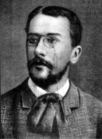
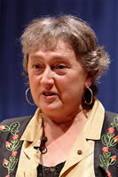
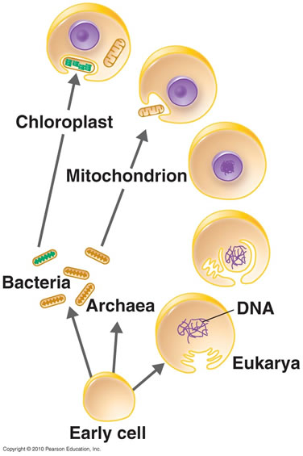

##Symbiosis: mitochondria and chloroplasts

* * * * *

**The sequential endosymbiotic origins of eukaryotes:** Compared to
bacteria and archaea, the typical eukaryotic cell is much more
structurally complex.

While the prokaryotes have a rigid cell wall, the ancestral eukaryote
appears to have been wall-less (the walls of plant cells appear to
represent a adaptation, and are not homologous to prokaryotic cell
walls).

*Figure: A eukaryotic cell. Click the image to learn more*

In addition to a nucleus (wherein the cell’s DNA is located, and which
we will return to in the next section), there are cytoskeletal
structures, including distinctive flagella (quite different from those
found in prokaryotes), an active (motile) plasma membrane, capable of
engulfing other cells, and multiple internal membrane systems. (A more
complete description of cell structure is beyond the text).

In aerobic bacteria and cyanobacteria, the electron transport chains
associated with ATP synthesis (through either photosynthesis or aerobic
respiration) located within the plasma membrane (and in the case of
cyanobacteria, internal membrane systems as well).

The same processes (aerobic respiration and photosynthesis) occur within
eukaryotic cells. Animals have aerobic respiration, while plants have
both).

However, these processes do not occur on the plasma membrane, but rather
within distinct cytoplasmic organelles: mitochondria for aerobic
respiration and chloroplasts for photosynthesis. All eukaryotic cells
have mitochondria, plants (which are eukaryotic) have both mitochondria
and chloroplasts.

An intriguing evolutionary question was, are these processes related,
that is, are the processes of aerobic respiration and photosynthesis
found in eukaryotes homologous to the processes found in bacteria and
cyanobacteria, or did they originate independently.

The path to understanding that homologous nature of these processes
began with studies of cell structure.

* * * * *

[In 1883, Andreas Schimper (1856-1901) noticed that chloroplasts
divided independently of their host
cells.](http://en.wikipedia.org/wiki/Konstantin_Mereschkowski)

[Building on Schimper’s observation, Konstantin Merezhkovsky (1855-1921)
proposed that chloroplasts were originally independent organisms, and
that plant cells were chimeras, really two independent organisms living
together.](http://en.wikipedia.org/wiki/Konstantin_Mereschkowski)

In 1925 Ivan Wallin (1883-1969) proposed that the mitochondria of
eukaryotic cells were derived from bacteria.

The endosymbiotic origins of eukaryotes (and mitochondria and
chloroplasts) fell out of favor, in large part because the molecular
methods needed to unambiguously resolve these questions were not
available.

A breakthrough came with the [endosymbiotic
hypothesis](http://www.ncbi.nlm.nih.gov/pubmed/11541392) put forward by
Lynn Margulis (1938-2011).

Based on large amounts of molecular data and ultrastructural data, 
she concluded that all eukaryotes are derived from an ancestor that engulfed an aerobic 
α-proteobacteria-like bacterium.

These bacteria survived within the eukaryotic cell, becoming an
endosymbiont, which over time became mitochondria. All eukaryotes
(including us) are descended from the mitochondria-containing eukaryote.
This event is thought to have occurred around 2 billion years ago.

That said the origin and nature of the engulfing cell remains unclear,
it may have arisen from, or was derived from an [archaeal
ancestor](http://en.wikipedia.org/wiki/Archaea#Relation_to_eukaryotes).

The next step in eukaryotic evolution involved a second endosymbiotic
event in which a cyanobacteria-like bacterium formed an endosymbiotic
relationship with a mitochondria-containing eukaryote.

](http://users.rcn.com/jkimball.ma.ultranet/BiologyPages/E/Endosymbiosis.html)

*Figure: Eukaryotic origins. Click the image to learn more*

This lineage gave rise to the [glaucophytes](http://en.wikipedia.org/wiki/Glaucophyte), 
the red and the green algae. The green algae are the ancestors of all plants

*Figure: Primary endosymbiosis*

The presence of chloroplasts and photosynthesis in other protist linages (e.g., *Euglenids*, brown algae and golden algae) is 
due to a secondary endosymbiotic event. The ancestor of these lineages engulfed an ancient glaucophyte.

*Figure: Secondary endosymbiosis*

As we look through modern organisms there a number of examples where we
find evidence for one organism becoming inextricably linked to another
through endosymbiotic processes.

There are also examples of close couplings between organisms that are
more akin to parasitism (rather then mutually beneficial symbiosis
[[link](http://www.sciencemag.org/content/304/5668/248.full)].

* * * * *

**Questions to answer**

1.  Are the mitochondria of plants and animals homologous or analogous?
2.  Did the earliest eukaryote have a cell wall? why or why not.
3.  What advantage would the host cell get from these symbionts? was
    there an advantage for the engulfed bacteria?
4.  Define the difference between a symbiotic and a parasitic
    relationship?

**Questions to ponder**

-   What evidence would lead you to suggest that there were multiple
    symbiotic events that gave rise to the mitochondria of different
    eukaryotes?
-   Why might a plant cell not notice the loss of mitochondria?

* * * * *