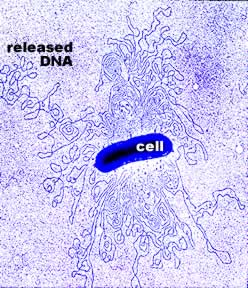
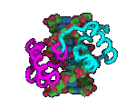
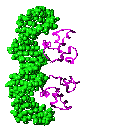
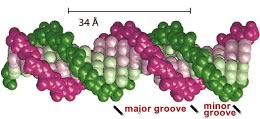
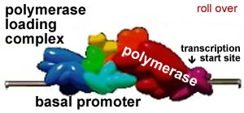
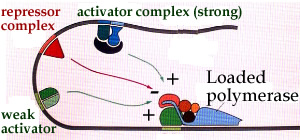
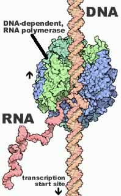

**Genomes & genes**

* * * * *
 
The larger the [genome](http://en.wikipedia.org/wiki/Genome), the more
information it can, at least in theory, contain. 

The organism with the largest known genome is the plant, *Paris
japonica* ([Pellicer et al,
2010](http://www.sciencedaily.com/releases/2010/10/101007120641.htm)),
with an estimated size of \~150,000 x 10^6^ (millions of) base pairs,
which compares to the \~3,200 x 10^6^ base pairs of humans (which
encodes approximately 25,000 genes). 

Smaller genomes are found in bacteria and archaea, but the smallest
genomes occur in obligate parasites and endosymbionts (can you guess why?). 

For example, the bacterium [*Mycoplasma
genitalium*](http://www.ncbi.nlm.nih.gov/entrez/query.fcgi?holding=npg&cmd=Retrieve&db=PubMed&list_uids=7569993&dopt=Abstract),
the cause of non-gonococcal urethritis, contains \~0.580 x 10^6^ base
pairs of DNA, which encodes \~500 distinct genes. It has the smallest
genome found for an organism that can be grown independently.  Using
mutagenesis studies, Lewis et al
([2006](http://www.pnas.org/content/103/2/425.full)) found that 382 of
its genes are essential, of which \~28% had unknown functions. 

The obligate endosymbiont, *Carsonella ruddii* has 159,662 (\~0.16 x
10^6^) base pairs of DNA encoding "182 ORFs (*open reading frames =
genes*), 164 (90%) overlap with at least one of the two adjacent ORFs"
(Nakabachi et al, 2006).

 
)](./img/Carsonella.jpg)

* * * * *

**Locating information within DNA:**

The DNA molecules that contain genes can be thousands to millions of
base pairs in length. More to the point, a single DNA molecule can
contain hundreds to thousands of genes. 

To access the information stored in a gene, it is necessary to find the
sequence of the gene so that it can be transcribed (copied) into RNA. This
sequence has to be recognized and distinguished from all of the other
DNA sequences present within the cell. 

This is accomplished by using a two-component system.  The first part of
this system are specific nucleotide sequences within the DNA (very much
like the origin of replication sequences we discussed before.)

These sequences provide a molecular address that can be used to identify
the specific region of a specific strand of the DNA to be transcribed. 
The set of sequences involved in identifying the region of a gene to be
transcribed is known as the gene's regulatory region. 

The regulatory region of a gene can be simple and relatively short or
complex and extremely long. In some human genes, the gene's regulatory
region is spread over thousands of base-pairs of DNA, located both
"up-stream" and "down-stream" of the coding region.

You can carry out a simple mathematical exercise, how long would a
nucleotide sequence have to be, to be unique within 3,200,000,000 base
pairs? 

 
Regulatory DNA sequences are recognized by proteins that bind to DNA in
a sequence specific manner; these proteins are known as transcription
factors because they regulate transcription.  

Specific regulatory sequences are bound by specific transcription
factors, and it is common that multiple transcription factors are used
together (combinatorially) to recognize and regulate the expression of
specific genes.

A specific transcription factor can act either positively or
negatively.  

Positively-acting transcription factors, known as activators, stimulate
transcription. 

Negatively-acting transcription factors, known as repressors, suppress
transcription.

Sometimes a transcription factor that acts positively at one DNA
regulatory site will act negatively at another, depending upon its
interactions with other proteins that bind near by, or that associate
with the transcription factor. Transcription factors are ""context
dependent".
 

DNA-binding transcription factors recognize specific DNA sequences by
interacting with the surfaces of the base pairs visible in the major and
minor grooves of the DNA helix.

A single base pair change in a gene's regulatory region can profoundly
alter the efficiency or timing of transcription.

* * * * *

]

The binding of transcription factors recruits or inhibits the
recruitment of an enzyme complex, the DNA-dependent, RNA polymerase, to
the DNA.

This RNA polymerase synthesizes RNAs.

Where RNA polymerase starts transcribing RNA is known as the
transcription start site. Where it falls off the DNA, and so stops
transcribing RNA, is known as the transcription termination site.

As transcription initiates, the RNA polymerase moves away from the
transcription start site. 

Once the RNA polymerase complex moves far enough away (clears the start
site), there is room for a new polymerase complex to associate with the
DNA, through interactions with transcription factors. 

The efficiency of RNA polymerase binding and activation determines the
rate at which RNA molecules are produced. 

 

*RNA polymerase bound to DNA, click the image to learn more about the process of transcription*

* * * * *

**Questions to answer**

1.  Make a diagram that illustrates how genes could "overlap". Explain what your diagram looks like.
2.  Present a model for how the binding of a transcription determines
    which DNA strand will be transcribed. 
3.  Why does binding of combinations of transcription factors increase
    the selectivity of the regulatory system.
4.  Describe the possible effects of a mutation that alters the
    DNA-binding specificity of a particular transcription factor.
5.  Describe the possible effects of a mutation that alters the sequence
    normally recognized by a specific transcription factor.
6.  Describe the possible effects of a mutation that reduces the
    activity of DNA-dependent, RNA polymerase.
7.  Consider a particular gene, what factors are likely to influence the
    length of its regulatory region?

**Questions to ponder**

-   What factors might drive he evolution of overlapping genes?
-   Explain why parasites and endosymbionts can survive with so few
    genes.

* * * * *
