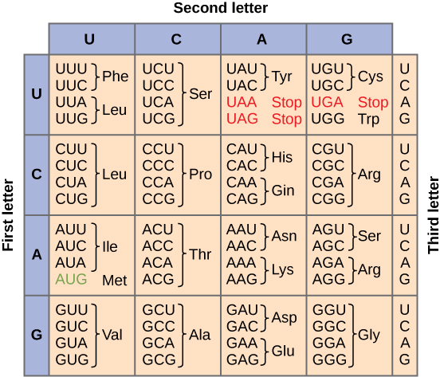
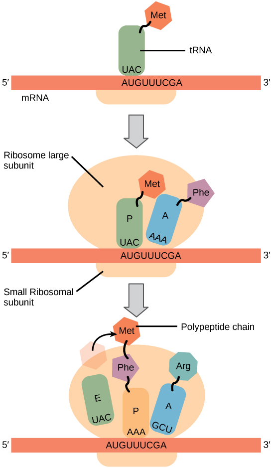

###Making polypeptides (and proteins)

* * * * *

DNA is more or less inert, it acts simply to store information. For that
information to be used and useful, it must be transformed first into
[RNA](http://en.wikipedia.org/wiki/RNA); this process is known as
[transcription](http://en.wikipedia.org/wiki/Transcription_%28genetics%29).

It is called transcription because there is no “change in language”;
information is encoded in the same way, through the sequence of bases in
both DNA and RNA.

Transcription is mediated by DNA-dependent, RNA polymerase, an enzyme
that builds an RNA molecule using a DNA molecule.  We will return to
consider the process of transcription and its regulation later.

When the information is to be used to produce a polypeptide, the RNA is
known as a messenger RNA or
[mRNA](http://en.wikipedia.org/wiki/Messenger_RNA). The information in
the mRNA will then be translated from a nucleotide into a polypeptide
sequence. This process involves a large macromolecular complex, the
ribosome, and various accessory factors.

The sequence of nucleotides in DNA is related to the final sequence of
the polypeptide by the [genetic
code](http://en.wikipedia.org/wiki/Genetic_code).

The genetic code is not the information itself, but the
[algorithm](http://en.wikipedia.org/wiki/Algorithm) by which nucleotide
sequences encode polypeptide sequences. The code consist of codons,
which are nucleotides, read three at a time without spaces.

Since there are 4 nucleotides, there are 4^3^ (or 64) possible codons.
Since all organisms use the same 20 amino acids, the code is redundant -
certain amino acids are encoded for by more than one codon.

There are also three codons, UAA, UAG and UGA that encode “stops” or
periods.
 

[*Figure: The genetic code algorithm*](http://en.wikipedia.org/wiki/Genetic_code)

In addition to the common 20 amino/imino acids, there are times when
other amino acids are used, in particular selenocysteine and
pyrrolysine.

In the case of selenocysteine, the amino acid is encoded by a stop
codon, UGA, that is in a particular context within the RNA [see
[here](http://www.ncbi.nlm.nih.gov/pubmed/8811175) for more details -
totally optional].

[Selenocysteine](http://en.wikipedia.org/wiki/Selenocysteine)

In the case of pyrrolysine, coding also involves a stop codon. In this
case, a gene encodes a special tRNA that recognizes the normal stop
codon UAG (and is charged with pyrrolysine - see below).

[pyrrolysine](http://en.wikipedia.org/wiki/Pyrrolysine)

There are a number of hypotheses on the origin of the genetic code, from
the frozen accident model, to one in which specific interactions between
RNAs and amino acids play an important role.

What these unusual amino acids, and other variations in the genetic code
([see
here](http://www.nature.com/nrg/journal/v2/n1/abs/nrg0101_049a_fs.html;jsessionid=AD81AAA41AE9E5E43F0D6F3EE71A6CE3)),
illustrate is that evolutionary mechanisms can change the genetic code.
Since it does not appear to be “predetermined”, the general conservation
of the genetic code among organisms is seen as strong evidence that all
organisms (even the ones with minor variations in the genetic code) are
derived from a single common ancestor.

It appears that the genetic code is a homologous trait between all
organisms.

* * * * *

Translation involves a complex cellular organelle, the
[ribosome](http://en.wikipedia.org/wiki/Ribosome), which together with a
number of accessory factors, including transfer or tRNAs, reads the code
in an mRNA and produces the appropriate polypeptide.

[can’t stop yourself? [click here](translation-details.htm) for a more
detailed description of translation.]

In general (but not always), the first 5’ AUG in the mRNA, which encodes
the amino acid methionine, serves to mark the start of translation.

Ribosomes are composed of roughly equal amounts of ribosomal (rRNAs) and
ribosomal polypeptides. An active ribosome is composed of a small and a
large ribosomal subunit.

The complete ribosome has a molecular weight of \~3 x 10^6^ daltons. A
evolutionarily conserved catalytic rRNA, a ribozyme, lies at the heart
of the ribosome - it catalyzes the addition of amino acids to the
growing polypeptide chain.

The cytoplasm of cells is packed with ribosomes. In a rapidly growing
bacterial cell, approximately 25% of the total cell mass is ribosomes.

*Figure: A David S. Goodsell image.*

Although structurally similar, there are characteristic differences
between the ribosomes of bacteria and eukaryotes.

This is important from a practical perspective. For example, a number of
antibiotics selectively [inhibit translation by
bacterial](http://www.bmb.leeds.ac.uk/mbiology/ug/ugteach/icu8/antibiotics/protein.html),
but not eukaryotic ribosomes.

Both chloroplasts and mitochondria have ribosomes of the bacterial type.

This is yet another piece of evidence that chloroplasts and mitochondria
are descended from bacterial endosymbionts.

The small and large subunits of the ribosome remain separate until they
find an mRNA.

Together with accessory factors, they associate with the mRNA and
assemble into a functional ribosome, which then translates the mRNA.

When the ribosome reaches the end of the region of the RNA that encodes
the polypeptide (defined by a stop codon), it is released, disassembles
and is ready to [start another cycle](translation-details.htm).

Key translation accessory factors are the transfer RNAs or tRNA.

These are small, L-shaped RNAs. There are specific tRNAs for each amino
acid. For example, a tRNA specific for phenylalanine would be written
tRNA^Phe^.

Enzymes, amino acyl tRNA synthetases, recognize specific tRNAs and
catalyze the attachment of the appropriate amino acid to the tRNA’s
acceptor stem.

A codon in an mRNA is recognized by the anticodon in the tRNA molecule.

**Initiating translation:** To make the correct polypeptide, the ribosome
must start translating an mRNA at a specific point, the start codon.

In eukaryotes, the initial amino acid of the polypeptide is almost
always encoded by the first 5’ AUG in the mRNA, its position determines
the “reading frame” of the mRNA (with each subsequent triplet being
recognized by the appropriate amino acid charged tRNA. Similarly, the
end of the polypeptide is marked by a stop codon(UGA, UAA or UAG).

A

*Figure: tRNA associated with the elongation factor TU (EF-TU)*

Accessory factors are associated with translation initiation, elongation
and termination.

The mRNA moves through the ribosome, bringing one codon after another
into place.

Each codon is recognized by an amino acid-charged tRNA.

 

This is a stochastic process , on average many amino-acid charged tRNAs
will collide with the ribosome before the “right” one (determined by the
codon-anti-codon interaction), hits and binds productively.

Once in place, the ribosome catalyzes the formation of a peptide bond
and the transfer of the growing or **nascent polypeptide** to the newly
arrived amino acid-charged tRNA and the release of the now uncharged
tRNA.

[Here is a nice translation tutorial](http://www.johnkyrk.com/DNAtranslation.html)

(What is (seriously) unrealistic about this tutorial?)

The process of translation uses energy (in the form of coupled
reactions) both to move the mRNA through the ribosome and to form the
peptide bonds.

Normally, there are no tRNAs that recognize stop codons, so when the
ribosome reaches a stop codon, it stalls as it waits for a charged tRNA
which will never arrive.

Instead, a polypeptide known as a release factor, which looks very much
like a tRNA, can bind instead. This leads to the release of the
polypeptide from the ribosome, and the disassembly of the translation
complex.

* * * * *

<embed width="420" height="345" src="http://www.youtube.com/v/TfYf_rPWUdY" type="application/x-shockwave-flash"> </embed>

*****

**Questions to answer**

1.  What types of molecules can DNA encode directly? How about
    indirectly?
2.  Aside from mRNA, which RNAs are involved in protein synthesis?
3.  How, in the most basic terms, do different tRNAs differ from one
    another?
4.  How many different tRNA-amino acid synthetases do you think there
    must be in a cell?
5.  What could happen if a ribosome started translating an mRNA at the
    “wrong” place?
6.  Why doesn’t the presence of release factor in the cell cause the
    premature termination of translation at non-stop codons?

**Questions to ponder**

-   What does it mean to say the genetic code is an algorithm?
-   Do variations in the genetic code argue for against a common
    ancestor for life on earth?
-   What is meant when people call the genetic code a “frozen accident”?

* * * * *