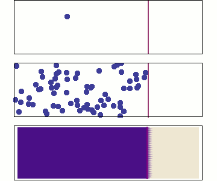

###Getting through membranes

* * * * *

Lipid bilayer membranes pose a serious barrier to the movement of larger
molecules and small, hydrophilic molecules.

This barrier property enables cells to use membranes as boundaries, to
keep components inside and to exclude many unwanted molecules.

The permeability barrier properties of the lipid portion of the membrane
are rather non-specific. If you are hydrophilic, this barrier is quite
high.

On the other hand, if you are hydrophobic, the barrier is low, but you
may find it difficult to leave the membrane once you enter it.

The more hydrophobic a molecule, the more readily it passes into a
membrane.

The cell can control which types of molecules enter and leave using
proteins embedded within the membrane - we will return to these shortly.

The combination of lipids and proteins can produce quite complex
behaviors. Some biological membranes act as batteries, storing
electromechanical energy, others can carry signals over long distances
(your nervous system uses membranes this way.)

**Membrane evolution**: The modern cell membrane is composed of lipids
with hydrocarbon or isoprene chains, typically ranging from 16 to 20
carbons in length.

The earliest membranes were likely to have been composed of similar, but
simpler molecules with shorter hydrophobic chains.
 
Based on the properties of lipids, we can map out a plausible sequence
for the appearance of membranes.

Lipids with very short hydrophobic chains, 2 to 4 carbons long, can
dissolve in water (can you explain why?) As the lengths of the
hydrophobic chains increases, the molecules begin to self-assemble into
micelles.

By the time the hydrophobic chains reach \~10 carbons in length, the
molecules begin to associate into semi-stable bilayers. Bilayers can
“capture” regions of water.

Bilayer stability increases further as hydrophobic chain length
increases. At the same time, membrane permeability decreases.

It is a reasonable assumption that the earliest biological systems used
shorter chain lipids to build their [“proto-membranes”](http://astrobiology.arc.nasa.gov/workshops/1996/astrobiology/speakers/deamer/deamer_abstract.html)
and that these membranes were relatively leaky. 

Cells must exchange materials with the outside world in order to survive, 
maintain their structure, to grow and to reproduce.

The appearance of more complex lipids, capable of forming more
impermeable membranes must therefore have depended upon the appearance
of mechanisms that enabled hydrophilic molecules to pass through
membranes.

The process of interdependence of change is known as co-evolution.

> *Movie: Protocel forming from fatty acids (Click image to watch).**Note** do you understand that this video represents a three-dimensional process?*

**Aqueous pores in membranes:** In the late 1940’s Collander and
colleagues studied the movement of molecules into cells.

They noticed that small, water soluble molecules entered cells faster
than predicted based on the assumption that the membrane acted like a
simple hydrophobic barrier - this assumption was known as Overton’s Law.

Collander and colleagues postulated that membranes contained features that
enabled them to act as molecular sieves.

These “features” turned out to be protein pores, channels, and pumps which
we will discuss later.

* * * * *
 
**Diffusion:** A group of particles, initially confined to a small
volume will, over time, disperse. This movement is produced by
collisions with neighboring molecules, which are in constant motion.

This asymmetry of behavior is the basis of the [second law of
thermodynamics](http://secondlaw.oxy.edu/two.html), it is described by
the concept of entropy.

If there is a difference between the concentration of a molecule in one
region compared to another, that is known as a concentration gradient.
There will be a netflux from the region of high concentration to the
region of low concentration.

 

This means that for a cell that has a difference in the concentration of particles or solutes (e.g., salts, proteins, sugars, etc..) on either side of a membrane, there will be a netflux of the particle or solutes down its concentration gradient until the concentrations equalize. This, of course, assumes that membrane is also permeable to a a particular particle. 

Cells use concentration gradients and diffusion to do work. The concentration gradient across a semipermeable membrane represents stored potential energy. There are numerous examples where the cell accomplishes some pretty amazing tasks using this simple mechanism as energy source (i.e., production of ATP and electrical signals of the nervous system). Understanding much human physiology relies on understanding concentration gradients and diffusion.   

**Osmosis:** Solvent can also move across membranes and osmosis is the net movement of
solvent (like H~2~0) into or out of the cell.

Cells are packed full of molecules. The concentration of molecules inside of the cell is usually much greater than outside. These molecules take up space, space no longer occupied by water. Intuition might lead you to believe that since the concentration of water outside of the cell **[H~2~O]~out~** is higher than the concentration of water inside the cell **[H~2~O]~in~** that osmosis involves the diffusion of water down its concentration gradient (In fact most biology textbooks describe it this way). 

**Note:** The presence of brackets means concentration. **[A]** means the
concentration in moles per liter of the molecule A.

This is not how osmosis works; osmosis is actually a pretty wacky and somewhat counterintuitive phenomena. To understand what is really going on, we need to look at molecular interactions occurring in the vicinity of channels that allow water (and nothing else) to move into and out the cell. We will discuss what these channels are later on. 

You already know there is an asymmetry in the solute concentrations on either side of the cell membrane ([solutes]~in~ > [solutes]~out~). For simplicity, let assume that the outside of the cell is pure water ([solutes]~out~ = 0) and the inside is a mixture of water and solutes ([solutes]~in~ = high). You also know that water and solute molecules are in constant motion (average kentic energy of particles is related to temperature).

 

On the inside of the membrane (and only the inside in this example), solute molecules approach, collide, and "bounce" away from the channel (just like tossing a ball against a wall). The of motion of particles headed away from the channel exerts a force on the water molecules in the channel. Since this force is directed away from the channel, water molecule are pulled through the channel and into the cell. The motion of the solute molecules inside our hypothetical cell "suck" water molecules through the membrane channel. In this example, there are no solute molecules outside to "suck" molecules in the other direction so water flows inside the cell.

So we have a general rule: water flows via osmosis toward the region with higher solute concentration. The side with more particles in solution provide more collisions with the channels. The affect of these collisions (i.e., bouncing away from the channel) is to pull water molecules across the membrane, through the channel, toward the side with higher solute concentration. 

Pretty wacky, huh? 

* * * * *

The solute gradient is capable of doing work – it can lift a fraction of
the solution against the force of gravity. At equilibrium, the force generated by osmosis is balanced by the weight of the levitated solution. In an important sense, the concentrated cytoplasmic organization of the cell represents stored energy. 

Again, many important human physiological processes depend upon osmosis. These include: maintenance of blood pressure and maintenance of water/salt balance of tissues and the blood. 

* * * * *

  --
  --

**Dealing with osmosis:** The water concentration gradient across the
plasma membrane of most organisms leads to an influx of water into the
cell, particularly if there are water channels in the
membrane.

As water enters the cell, the plasma membrane will expand. If the influx
of water continues, the membrane will burst like an over-inflated
balloon. 

Organisms, such as plants, fungi and bacteria, use cell walls to deal
with the influx of water. The cell wall is a specialized and relatively
rigid polymer-based, extracellular matrix located outside of the plasma
membrane.

The space between the cell wall and the plasma membrane is known as the
periplasmic space**.**

As water enters the cell (by osmosis), the plasma membrane is pressed up
against the cell wall at the expense of the periplasmic space.

The force exerted by the cell wall on the membrane balances the force of
water entering the cell.

\
 

When the two forces are equal, the net influx of water into the cell
stops. When the [water] outside decreases, this pressure is reduced and
the plant wilts.

This is a passive effect, built into the wall when it was first
assembled. Once the cell wall has been built, a cell with a cell wall
does not need to expend energy to resist osmotic effects.

  --
  --

**Dealing with osmosis without a cell wall:** Animal cells do not have a
rigid cell wall. This allows them to be active predators, moving rapidly
and engulfing their prey (organisms with a rigid cell wall can’t do
that!)

It also means, however, that they must use other mechanisms to deal with
the effects of osmosis.

Most free living protozoa, single celled eukarya without a rigid
external wall, live in dilute aqueous solutions, where osmotic effects
are significant.

They deal with the constant in-flux of water by actively pumping the
water that flows in back out again using an organelle known as the
contractile vacuole.

Water accumulates within the contractile vacuole, a membrane-bounded
structure, which inflates.

  --
  --

To expel the water, the vacuole connects with the plasma membrane and is
squeezed by cytoskeletal systems within the cytoplasm.

This squirts the water out of the cell. The process of vacuole
contraction is an active one, it involves work and requires energy.

The cells of your own body are not immune to the affects of osmosis. As an example, the plasma (i.e. water portion) of human blood and red blood cells have nearly equal solute concentrations. Imagine the consequences if you were given an IV of solution that was pure water. Your red blood cells could swell and burst, causing anemia. 

* * * * *

**Questions to answer:**

1.  Using the osmosis experiment above, how would you get water to move
    from the right side to the left side of the membrane? How could such
    a system be used to purify water?
2.  For diffusion, is there a “force” driving the movement of molecules “down” their
    concentration gradient?
3.  Where does the energy involved in moving molecules come from?
4.  Does building a cell wall require energy?
5.  Would you expect the membrane of the contractile vacuole to be more
    or less permeable to water than the cell’s plasma membrane?
6.  How would increasing the length of the lipid’s hydrocarbon chains
    effect the structures that it can form?
7.  How does the structure formed by lipids change if the concentration
    of water drops dramatically (for example if I dry out my sample).

**Questions to ponder:**

-   Why is the movement of materials through the membrane essential for
    life?
-   How might an organism use its contractile vacuole for propulsion?
-   Plants and animals are both eukaryotes; how would you decide whether
    the common ancestor of the eukaryotes had a cell wall?
