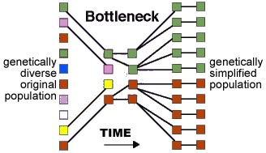

###Non-adaptive evolutionary events: sampling effects

*****

You might think that all evolutionary processes are by their very nature adaptive, but 
this is not the case.

Accidents can "select" a small subset of organisms from the larger population.

Founder effects and evolutionary bottlenecks occur when a new population is based on a 
small, randomly selected group of individuals.

The founder effect applies when a small group of individuals first colonizes a new and 
isolated territory, such as an island. An evolutionary bottleneck occurs when some 
disaster or disease quickly reduces a once large population to a much smaller one. 
The original, large population is likely to have had a large and diverse set of alleles 
within it. The smaller founder/post-bottleneck populations will often have, by chance, 
a less diverse set of alleles. 

It is possible that alleles that were rare in the original population will be more 
common in the founder/post-bottleneck population. 

These traits may or may not be adaptive in the new environment; in some cases they 
can be detrimental, and mutation and natural selection will then work to eliminate 
them or ameliorate their effects.

There is strong evidence for a severe evolutionary bottleneck during the course of 
[human evolution](http://www.dubage.com/API/ThePolymath/1.1/ThePolymath0701ebam.html). 
Once a population is small, the effects of genetic drift will also increase and can 
become profound.

> "If a population is finite in size (as all populations are) and if a given pair of parents have only a small number of offspring, then even in the **absence of all selective forces**, the frequency of a gene will not be exactly reproduced in the next generation because of **sampling error**.\
>\ 
>
> If in a population of 1000 individuals the frequency of "a" is 0.5 in one generation, then it may by chance be 0.493 or 0.505 in the next generation because of the chance production of a few more or less progeny of each genotype.\
> \
>
> In the second generation, there is another sampling error based on the new gene frequency, so the frequency of "a" may go from 0.505 to 0.501 or back to 0.498. This process of random fluctuation continues generation after generation, with no force pushing the frequency back to its initial state because the population has no "genetic memory" of its state many generations ago.\
>\
>
> Each generation is an independent event. The final result of this random change in allele frequency is that **the population eventually drifts to p=1 or p=0**.  After this point, no further change is possible; the population has become homozygous.\
>\
>
> A different population, isolated from the first, also undergoes this random genetic drift, but it may become homozygous for allele "A", whereas the first population has become homozygous for allele "a".\ 
>\
>
> As time goes on, isolated populations diverge from each other, each losing heterozygosity. The variation originally present within populations now appears as variation between populations.\
>\
>
> - Suzuki et al., 1989. An Introduction to Genetic Analysis 4th ed. W.H. Freeman p.704

These non-selective, sampling-based effects are one reason that it can be difficult 
to determine whether a particular trait is adaptive or not. It really depends upon 
the history of the population.

The end result of founder effects, bottlenecks, and [genetic drift](http://www.talkorigins.org/faqs/genetic-drift.html) 
is that certain traits can be over-represented in a population by chance. 

*****

**Questions to answer**

1. Consider the various ways that the individuals that fail to pass through a bottleneck might differ from those that do; how many kinds of "reasons" can you identify?
2. Based on the Java Genetic Drift applet (below) - is it possible for an allele to go from 5% to 100% of the population simply by genetic drift?
3. How does selection act to limit the effects of genetic drift?
4. How might a genetic bottleneck lead to a population with a higher frequency of a deleterious trait than was present in the population before the bottleneck? 
5. Assume that all members of a population that pass through a bottleneck have a deleterious trait; can the population survive and, if so, how would selection act on the population after the bottleneck?
6. What is the difference between selection and drift? 
7. How is it that drift can be quantified, but in any particular experiment, not predicted?

**Questions to ponder**

1. What limits the "size" of the founder effect or a bottleneck effect?
2. Does passing through a bottleneck improve or hamper a population's chances for evolutionary success (that is, avoiding extinction)?

*****

Before class review [youtube introduction to the genetic drift applet](http://www.youtube.com/watch?v=B5M_C8gBvYo) and
use the [Java Genetic Drift applet](http://darwin.eeb.uconn.edu/simulations/jdk1.0/drift.html) to answer the questions (above): 

Use 20 experiments for each population size (N)(from 10 to 250) **and plot the frequency of allele loss as a function of population size** after 100 generations. 

- To do this you will need to determine the number of times that one or the other allele is lost for each 100 generations.  Call that number L, and the frequency of allele loss f~L~. Then f~L~ = L/20.   
   
	

 
	

