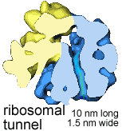
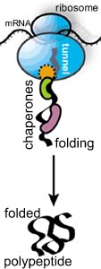
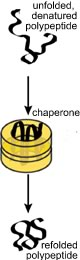
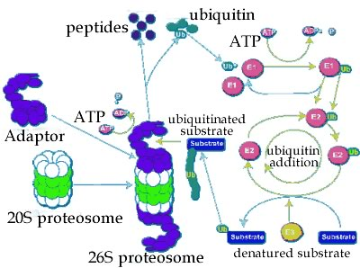
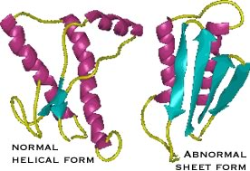
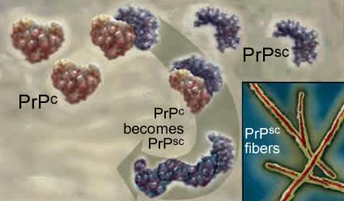

###Protein assembly & turnover

* * * * *

New amino acids are added to the polypeptide’s C-terminus, while the
N-terminus moves through a tunnel within the ribosome; about 15 amino
acids are added per second.

The ribosomal tunnel is approximately 10 nm long and 1.5 nm in diameter;
it is narrow enough to block the folding of the newly synthesized
polypeptide chain.

Translation, like most all processes that occur within the cell, is a
[stochastic](http://en.wikipedia.org/wiki/Stochastic) process, meaning
that it is based on random collisions between molecules. In the specific
case of translation, the association of the mRNA with the ribosomal
components occurs stochastically; similarly, the addition of a new amino
acid depends on the collision of the appropriate amino acid-charged,
tRNAs with the RNA-ribosome complex.

Since there are many “inappropriate” amino-acid charged tRNAs in the
cytoplasm, the ribosomal complex must be able to productively bind only
the tRNA the mRNA specifies, that is the tRNA with the right anticodon.
This enables its attached amino acid can interact productively to add
the amino acid to the growing polypeptide chain.

In most illustrations of polypeptide synthesis, you rarely see this fact
illustrated.

As the polypeptide emerges from the tunnel, it encounters the crowded
cytoplasmic environment; at the same time it begins to fold.

As it folds, the polypeptide needs to avoid non-specific interactions
with other cellular components. If it is part of a multisubunit protein,
it must “find” its partner polypeptides, again, a stochastic process.

<embed width="420" height="345" src="http://www.youtube.com/v/i8rGTYQ6oZ8" type="application/x-shockwave-flash"> </embed>
*Movie: Protein folding animation*

If the polypeptide does not fold correctly, it will not function
correctly and may damage the cell.

A number of degenerative neurological disorders are due, at least in
part, to the accumulation of misfolded polypeptides (see below).

A number of enzymes, known generically as chaperones, associate with the
nascent polypeptide as it emerges from the ribosome.

Chaperones facilitate the proper folding of the polypeptide, primarily
by suppressing or unfolding ‘incorrect’ structures (perhaps you can
guess how a chaperone “knows” something bad is going on).

Chaperones bind to, and stabilize polypeptides prior to their final
assembly into multisubunit complexes, the final active protein

<embed width="420" height="345" src="http://www.youtube.com/v/swEc_sUVz5I" type="application/x-shockwave-flash"> </embed>

<embed width="420" height="345" src="http://www.youtube.com/v/gFcp2Xpd29I" type="application/x-shockwave-flash"> </embed>

* * * * *

One class of chaperones are known as heat shock proteins.

These proteins recognize unfolded polypeptides - protein unfolding
occurs with increasing frequency at higher temperatures.

Heat-shock chaperones couple ATP hydrolysis reactions with polypeptide
unfolding reactions to unfold misfolded polypeptides. They then release
the unfolded polypeptide or protein, giving it another chance to refold
correctly, on its own.

How do chaperones recognize unfolded or abnormally folded proteins? They
look for hydrophobic regions on their surface.

Normal soluble proteins do not have such regions and the presence of
such domains can lead to non-specific protein-protein aggregates.

<embed width="420" height="345" src="http://www.youtube.com/v/b39698t750c" type="application/x-shockwave-flash"> </embed>

* * * * *

**Protein degradation:**

If a protein does not fold correctly, it is generally degraded by
enzymes known as proteases, enzymes that cleave proteins. This involves
forming a complex with the protease. Proteases cleave peptide bonds via
a hydrolysis reaction. The hydrolysis of a protein is a
thermodynamically favorable reaction.

It is the case that proteins differ in the probability that they will
form a productive complex with a protease. In this case, a productive
interaction means that the protein will be degraded. The process of
degradation is known as turnover, in part because the amino acids
released can be reused by the cell.

The end result of the processes of translation (protein synthesis),
folding, and degradation is that each protein in a cell has a half-life.
If we had a population of molecules, the half-life is the time at which
we would expect 50% of the those molecules present at time = 0 to have
been degraded through interactions with proteases.

There are a number of mechanisms involved in the turnover of proteins.

A common one involves a macromolecular machine, the proteosome.

The proteosome is a multienzyme complex that degrades polypeptides. The
proteases can be divided into two generic classes. Those that hydrolyze
polypeptides from one end or the other, to release one or twp amino acid
at a time, are known as exoproteases.

*Figure: Protein degradation via the proteosome complex*

Please note (in the video below), the unrealistic components.

<embed width="420" height="345" src="http://www.youtube.com/v/4DMqnfrzpKg" type="application/x-shockwave-flash"> </embed>

Proteases that cleave a polypeptide chain internally are known as
endoproteases - they generate two polypeptides.

Whether a protein is degraded depends upon how it interacts with other
molecules, particularly chaperones and proteosomes, and other proteases
[a mathematical analysis of protein (and RNA) half-life is beyond the
scope of this course, but you can read about it
[here](http://en.wikipedia.org/wiki/Protein_turnover) and
[here](http://www.ncbi.nlm.nih.gov/pubmed/15596551) if you wish.]

* * * * *

**Diseases of folding and misfolding:** If the functional protein is in
its native state, a dysfunctional misfolded protein is said to be
denatured.

It does not take much of a perturbation to unfold or denature most
proteins. In fact, under normal conditions, proteins often become
partially denatured. A number of diseases have been associated with
[protein
misfolding](http://www.faseb.org/opar/protfold/protein.html)

Kuru was among the first of these to be identified. Beginning in the
1950s, [D. Carleton Gadjusek](http://www.xrefer.com/entry/494426) (below)
studied a neurological disorder common among the Fore people of New
Guinea.

The symptoms of [kuru](http://www.xviral.co.uk/disease/kuru.htm), which
means “trembling with fear”, are similar to those of
[scrapie](http://www.niddk.nih.gov/intram/people/wickner/prions.htm), a
disease of sheep, and [variant Creutzfeld-Jakob
disease](http://www.emedicine.com/med/topic1248.htm) (vCJD) in humans.

Among the Fore people, kuru was linked to the ritual eating of the dead.
Since this practice has ended, the disease has disappeared.

**Prions and protein folding:**

The cause of kuru, scrapie and vCJD appears to be the presence of an
abnormal form of a normal protein, known as a prion. We can think of
prions as an anti-chaperone.

The idea of proteins as infectious agents was championed by Stan
Prusiner (below).

The protein responsible for kuru and scrapie is known as PrP^c^.
It normally exists in a largely α-helical form. There is a second abnormal form of the protein, 
PrP^sc^ for scrapie; it is composed primarily of β-sheet.

The two polypeptides have the same primary sequence. PrP^sc^ acts as an
anti-chaperone, catalyzing the transformation of PrP^c^ into PrP^sc^.

Once initiated, this leads to a chain reaction and PrP^sc^ accumulation.
As it accumulates, PrP^sc^ assembles into rod-shaped aggregates that
appear to damage cells.

This process occurs within the cells of the central nervous system, and
leads to severe neurological defects.

There is no natural defense, since the protein responsible is a normal
protein.

*****

**Disease transmission:** When the Fore ate the brains of their beloved
ancestors, they inadvertently introduced the PrP^sc^ protein into their
bodies.

Genetic studies indicate that early humans evolved resistance to prion
diseases, suggesting that cannibalism might have been an important
selective factor during human evolution.

Since cannibalism is not nearly as common today, how does anyone get
such diseases in the modern world?

There are rare cases of iatrogenic transmission, that is, where the
disease is caused by [faulty medical
practice](http://www.ncbi.nlm.nih.gov/pubmed/14522863), for example
through the use of contaminated surgical instruments or diseased tissue
for transplantation.

Where did these people get the disease? Since the disease is caused by
the formation of PrP^sc^, any event that leads to PrP^sc^ formation
could cause the disease.

Normally, the formation of PrP^sc^ from PrP^c^ is very rare. We all have
PrP^c^ but very few of us spontaneously develop kuru-like symptoms.
There are, however, mutations in the gene that encodes PrP^c^ that
greatly enhance the frequency of the PrP^c^ → PrP^sc^ conversion.

Such mutations may be inherited (genetic) or may occur during the life
of an organism (sporadic).

FFI is due to the inheritance of a mutation in the
[PRNP](http://www.ncbi.nlm.nih.gov:80/entrez/dispomim.cgi?id=176640)
gene; this mutation changes the normal aspartic acid 178 to an
asparagine.

.*](./img/FFI_CJD%20brains.jpg)

The squares mark brain regions affected; the lower section reveals the
presence of aberrant protein aggregates in these regions.

When combined with a second mutation in the PRNP gene at position 129,
the FFI mutation leads to [Creutzfeld-Jacob disease
(CJD)](http://www.ncbi.nlm.nih.gov/htbin-post/Omim/dispmim?123400).

The circles in the right hand brain schematic indicate regions affected
in CJD. There are holes or lacunae in the tissue. Both FFI and CJD are
late onset diseases. Symptoms first appear \~ 50 years of age.

So why do PrP^sc^ aggregates accumulate?

To cut a peptide bond, a protease must position the target peptide bond
within its catalytic active site. If the target protein’s peptide bonds
do not fit into the active site, they cannot be cut.

*Figure: Proteins have active sites*

Because of their structure, PrP^sc^ aggregates are highly resistant to
proteolysis.

They gradually accumulate over many years, a fact that may explain the
late onset of PrP-based diseases.

**For the pre-medical students among you**

<embed width="420" height="345" src="http://www.youtube.com/v/yzDQ8WgFB_U" type="application/x-shockwave-flash"> </embed>

* * * * *

**Questions to answer**

1.  Why does the ribosome tunnel inhibit the folding of the newly
    synthesized polypeptide?
2.  How would you expect protein degradation to be controlled?
3.  How does the presence of a prion^sc^ lead to the change in the
    structure of prion^c^, and is this necessarily a genetic change?
4.  Why is it, do you think, that FFI and CJD are late onset diseases?
5.  What, do you think, leads to the “lacunae” in brain tissue?

**Questions to ponder**

-   Why are proteins (and RNAs) degraded?
-   Which do you think would be more susceptible to proteolytic
    degradation, a compact or an extended polypeptide?

* * * * *