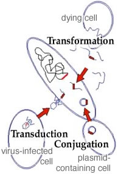
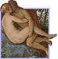
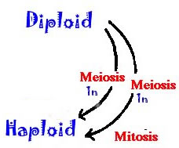
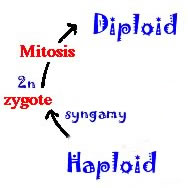
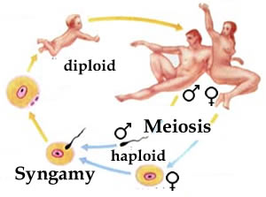
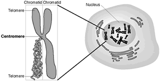

###Life cycles & sexual reproduction

* * * * *

Because of mutation, a gene can exist in different forms. These
alternative forms of a gene are known as alleles.

The complete set of alleles contained within an organism is known as its
genotype.

In asexual organisms, all of the different alleles are linked together
evolutionarily.  When the organism reproduces, all of the DNA (and all
of the alleles are replicated) and pass together, except for those
variations introduced by mutation, to their offspring.

This means that all of the alleles within the an asexual organism share a common
fate. They are inherited together and so evolve together.

A lethal mutation in one gene leads to the extinction of all.

If the effects of a deleterious mutation are not immediately lethal,
these effects may be ameliorated by mutations in other genes - the
genome adapts as a whole and competes with other genomes.

Even in asexual organisms there are ways for alleles to escape their
home genome and their linkage to other genes. One is the process of
horizontal gene transfer. 

Click the image to learn about bacterial resistance to antibiotics
 

Remember Griffith's observations on bacterial transformation?  That was
an example of horizontal gene transfer. 

The ability to transfer genetic information from one cell to another can
play a key roll in biologic communities. The rapid spread of antibiotic
resistance is due in large part to the [horizontal transfer of
resistance
genes](http://www.nature.com/nrmicro/focus/genetransfer/index.html).

On the other hand, horizontal gene transfer can also lead to
selfish behaviors; for example a genetic element that is no longer
condemned to remain associated with its host's genome can replicate at
the host's expense and then change hosts (a parasitic relationship)!

A piece of DNA may evolve to facilitate its own spread from organism to
organism via horizontal gene transfer.  It is commonly thought that
viruses have their origins in such selfish genetic elements. Most viruses are obligate intracellular parasites

There can be a serious conflict between the "interests" of a selfish
genetic element and its host. 

The appearance of selfish genetic elements will in turn lead to a
selective pressure to suppress their replication (because their
replication can lead to mutations, requires energy, and is generally not
good for the organism). 

The genomes of organisms are littered with inactivated remains of
selfish genetic elements, greater than 40% of the human genome is
composed of such parasitic DNA.

Much of the human genome that is not obviously derived from these
parasitic sequences may be derived from such sequences that have been
mutated beyond recognition.

Click the figure to learn about transposable (moveable DNA) elements

At the same time, processes like horizontal gene transfer allow alleles
to move around, to escape from their original host and form new
combinations with alleles from other organisms (which works because all
organisms use the same genetic code!)  Information can be shared between
lineages (as in the spread of multidrug resistance and other traits).

* * * * *

Click the figure to learn about the advantages of sexual reproduction

There is a second process by which combinations of alleles are shuffled
and new alleles created to form new genomes, it is known as **sex**.

The process of sexual reproduction involves two organisms which
cooperate to produce a new organism. For such cooperation to evolve,
each organism must benefit (reproductively) from the interaction. 

This involves what is known as[inclusive
fitness](http://www.genetics.org/content/176/3/1375.full). One obvious
benefit of sexual reproduction is that it generates new combinations of
alleles - it "liberates" (and enhances) genetic variation.

Sex in eukaryotes involves two processes, meiosis and syngamy.

Sexual organisms exist in haploid and diploid states. In the haploid
state, they have a single (1N) set of chromosomes and so a single allele
of each gene.

In the diploid state, they have two sets (2N) of chromosomes, one
derived from each parent; they therefore have two alleles of each gene.

The maternal and paternal sets of chromosomes are homologous; they each
contain the same set of genes in the same sequence along their length.

They may differ, however, in which allele is present at each gene
position. The position of a gene within a chromosome or genome is known
as its genetic locus.

Click the figure to view the human chromosome viewer

If mitosis and cytokinesis occur accurately, each daughter cell ends up
with the same number of chromosomes as the parent cell. 

If the parental cell is normal, that is it contains the exact number of
chromosomes typical for the species, it is said to be euploid, which
means true number.

If there is a defect in mitosis, daughter cells can inherit more or less
than the euploid number of chromosomes; such a cell is said to be
aneuploid.   

Aneuploid cells are abnormal – such cells are often found in cancers. In
the context of embryonic development, most aneuploids are lethal. Some human aneuploid embryos survive, 
trisomy-21 (Down's syndrome) is an example. 

* * * * *

Sexual reproduction is associated with the process of meiosis - a
modified form of mitosis. Meiosis occurs only in diploid cells, and
produces haploid progeny.

The haploid (1N) products of meiosis are known as gametes.

During meiosis, homologous chromosomes align with one another in a
process known as synapsis. Each maternal chromosome aligns with its
homologous paternal chromosome; this alignment is generally exact to the
base pair.

Syngamy, which is also known as fertilization, mediates the transition
from haploid to diploid.

During syngamy, two haploid cells fuse.  Cell fusion is followed by
nuclear fusion, leading to the formation of a diploid cell. This diploid
cell has two sets of chromosomes and so is 2N.

A number of plants, such as the mosses, spend a significant amount of
their organismic life cycle in the haploid state. During this haploid
phase, the organisms are known as
[gametophytes.](http://www.wikipedia.org/wiki/Gametophyte)

In most plants (like most animals),the gametophytic stage is quite short
and contained within the diploid form, known as a sporophyte (in
plants).

Gametes that do not undergo syngamy shortly after they are formed or
activated, die. 

When gametes are different sizes, the larger are called eggs and the
smaller sperm.

Organisms that produce sperm are male, those that produce eggs are
female.

In some species, an organism can produce both sperm and eggs
simultaneously, such an organism is known as a hermaphrodite, after the
Greek gods Hermes and Aphrodite.

Sexual identity is not necessarily fixed.  There are also organisms that
can change sex over time, these are known as
[sequential](http://www.reefscapes.net/articles/articles/2002/hermaphroditism.html)[hermaphrodites](http://www.reefscapes.net/articles/articles/2002/hermaphroditism.html).
([short video)](http://www.youtube.com/watch?v=GTPLw3fGocY).

In a number of fishes, for example, sexual identity can be influenced by
social interactions.  In the absence of a male, the largest (dominant)
female will become male, making sperm rather than eggs.  This is a trait
that has originated independently, multiple times

 

Click the image to learn more about sequential-hermaphrodism 

 
* * * * *

**During meiosis** homologous, replicated maternally and
paternally-derived chromosomes align with one another (synapsis).  Once
aligned the homologous (maternal and paternal) chromosomes undergo
crossing over.

<embed width="420" height="345" src="http://www.youtube.com/v/i4jTu7IN65k" type="application/x-shockwave-flash"> </embed>

Video tutorial: Mitosis and meiosis

 
The first meiotic division divides the chromosomes randomly from the
original diploid set – some are maternal, some paternal.

Humans have 23 pairs of chromosomes.

The process of independent chromosome assortment can produce 2^23^
different gametes, a rather large number.

The end result is that the paternal and maternal alleles are no longer
permanently inherited together. [link to[flash
applet](./img/chromosome1.swf)]

In addition, paternal and maternal chromosome are shuffled, and the
alleles alone any one chromosome are also shuffled, so that new
combinations of paternal and maternal chromosomes are generated. The
order of genes is not changed, but the pattern of alleles often is.

Each chromosome usually undergoes multiple crossing over events.

<embed width="420" height="345" src="http://www.youtube.com/v/A2AAbtv402A" type="application/x-shockwave-flash"> </embed>

[Try the crossing over[applet](./img/MultipleCrossOver.swf)]

The end result is the generation of chromosomes with new allelic
combinations.

The physical process of crossing over holds the two homologs (DNA
molecules) together until they are separated at meiosis I.

Together, independent assortment and recombination produce [vast
numbers](http://ase.tufts.edu/cogstud/papers/hirsch.fin.html) of
genetically distinct gametes. 

This process explains why each sexual organism is genetically unique.

An obvious benefit of sexual reproduction is the appearance of large
amounts of genomic variation with each new generation. 

Another is the elimination of deleterious mutations from the
population. 

In asexual organisms, each lineage is distinct and must "stumble" upon
evolutionary novelty on its own. Alleles are changed one by one and
tested in the same way. In a similar manner, there is no ready way to
get rid of deleterious mutations except to die.

This accumulation of mutations in asexual organisms is known as
[Muller's
ratchet](http://www.accessexcellence.org/BF/bf05/rothschild/bf05b33.html)
(that is right, the same Muller as the person responsible for Muller's
morphs.)

Meiotic recombination generates new chromosomes. Some have more
deleterious mutations, some fewer. Organisms with more deleterious
mutations are likely to die earlier than those with fewer -- the
population as a whole "sheds" deleterious mutations.

* * * * *

During S phase of the cell cycle, each chromosome replicates. 

The replicated chromosomes (sometimes known as chromatids), remain
attached to one another at a region known as the centromere. 

 

During mitosis, the attachment between chromatids is broken and one
chromatid is segregated to each daughter nuclei. 

During meiosis, the centromeres of the replicated chromosomes do not
separate until the second meiotic division. 

Click the image to learn more about the chromosomal location of some human diseases

Occasional mutations will flip a stretch of DNA within a chromosome,
producing an chromosomal inversion.

Sometimes, a chromosome may break and then be rejoined incorrectly to
another chromosome  – this is known as a chromosomal translocation. 

Such chromosomal rearrangements complicate synapsis and can lead to a
failure of meiosis, and hence sterility.

The accumulation of chromosomal rearrangements is one mechanism use to
establish [reproductive
isolation](http://www.nature.com/nsu/000525/000525-11.html) during the
formation of new species.

\

* * * * *

**Questions to answer**

1.  How would you define the "normal" version of a gene?
2.  What are the properties of a parasitic DNA sequence?
3.  Why would an aneuploid cell be abnormal in terms of gene expression?
4.  How is a mutation in a haploid cell different from a mutation in a
    diploid cell, in terms of its possible effects on an organism's
    phenotype?  
5.  How long is the gametic phase in the human males? in females?
6.  How might a new allele be generated during the course of
    recombination?
7.  Describe an inversion that does not alter gene expression.
8.  How can an inversion lead to a mutation?
9.  How might chromosomal rearrangements lead to reproductive
    isolation? 
10. How might a chromosomal inversion lead to the loss of genetic
    information during meiosis?  
11. What is Muller's ratchet, and compare how asexual and sexual
    organisms deal with its effects.
12. Aren't reproduction and sex (the act, not the identity) the same thing? 

**Questions to ponder**

-   Can there be multiple "wild type" versions of a gene?
-   Why does the set of alleles matter, isn't every trait determined by
    the alleles of a specific gene?
-   What does male and female mean, biologically?
-   How does it influence behavior (or does it)?

* * * * *