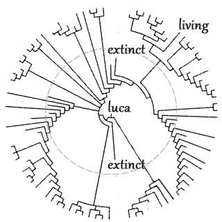
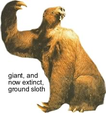
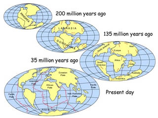
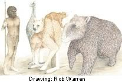
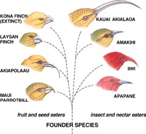
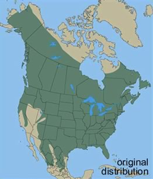
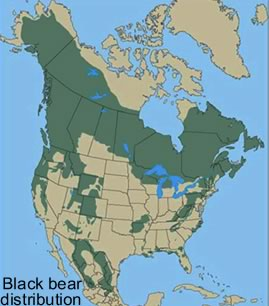
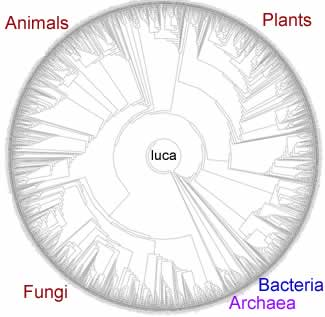
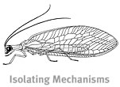
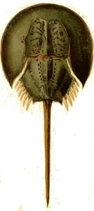

###Species: what are they, where do they come from, where do they go?

* * * * *

A
[species](http://users.rcn.com/jkimball.ma.ultranet/BiologyPages/S/Speciation.html)
is a **population** of organisms that can, and normally does, interbreed
successfully with one another but not with members of other populations
(other species).

Even quite similar looking organisms can be reproductively isolated
from one another; if so, they are biologically distinct species.

Over geological time, a species can have one of two fates – it can
continue, and occasionally divide so as to produce other species, or it
can become extinct. 

The idea of extinction is a relatively new one. In most non-scientific
views of the world, the world was created largely as is – organisms do
not become extinct nor do new types of organisms appear.  Why would
they? The creator does not presumably make mistakes.

Fossils of various types were known for quite some time, but were
originally thought to be either “jokes of nature” (*lusus naturae*) or
represent animals that still lived some where on earth.

This latter idea was plausible because much of the earth remained to be
explored (at least by European scientists). It was easy to imagine that
strange organisms lived elsewhere.

With the European “voyages of discovery” from the 15th through the 18th
centuries, the places where strange organisms could be hidden decreased
drastically. It seemed more and more likely that extinction was real.

[George Cuvier (1769-1832)](http://www.strangescience.net/cuvier.htm)
played a key role in establishing the science of paleontology and argued
persuasively that past ages had seen organisms that were quite distinct
from those now in existence. 

We now appreciate that the fossil record provides unambiguous evidence
that, at different times in the past, quite different types of organisms
existed.

 

The most famous of these extinct organisms are the
dinosaurs. [Dinosaurs](http://en.wikipedia.org/wiki/Dinosaurs), and
their extinct reptilian relatives, were found both on land and in the
sea. Flying reptiles,
[pterosaurs](http://www.ucmp.berkeley.edu/diapsids/pterosauria.html) and
others, ranged in size from that of small modern birds to large
airplanes.

The ancestors of this family of tetrapod (four legged) vertebrates first
appeared in the fossil record \~250 million years ago; they were a
dominant form of life from \~230 to 65 million years ago. 

During the Ages of Dinosaurs (the Triassic – 248 to 206 million years
ago, the Jurassic – 206 to 144 million years ago, and the Cretaceous
–144 to 65 million years ago), there were many different species of
dinosaurs, each characteristic of a particular age. 

* * * * *

Species of dinosaurs appeared and disappeared; what led to these
changes?  This leads to the broader question, why do species appear and
disappear? Why does extinction happen?

There are two general mechanisms. The first are more or less gradual
responses to new and changing environments. 

For example, there is an on-going process of continental drift, which is
largely responsible for earthquakes and volcanoes. 

About 200 million years ago, the supercontinent Pangaea broke up to form
the continents we know today. 

This led to changes in climate and the physical isolation of many types
of plants and animals.

There have been other periods when the Earth appears to have been
completely, or almost completely frozen over.

*Figure: Plate tectonics and continental drift. Click the image to learn more*

One such [snowball earth](http://en.wikipedia.org/wiki/Snowball_Earth)
period may have been involved in the emergence of macroscopic
multicellular life. Similarly, changes in atmospheric O~2~ likely caused
a number of extinction and speciation events.

Sometimes organisms that evolved on one continent get introduced into
another, for example through the land bridge between Asia and the
Americas. This can greatly perturb the species already present by
introducing new pathogens, prey, and predators. 

There can also be more drastic and acute events that lead to essentially
instant and unanticipated (and unanticipatable) environmental changes,
such as massive meteorite impacts or sustained volcanic eruptions. There
is evidence that such events are responsible for some observed mass
extinctions. 

The most catastrophic of these extinction events was the
[Permian](http://park.org/Canada/Museum/extinction/permcause.html)
extinction (\~245 million years ago), during which it appears that \~95%
of marine organisms and \~75% of land species died off.  The exact cause
of the Permian extinction event remains unclear, but global cooling due
in part to massive volcanic eruptions appears likely.   

It is widely held that the appearance of humans contributed to the
extinction of various pleistocene megafauna which occurred \~8000-10,000
years ago [[link](http://www.youtube.com/watch?v=8WZ5Q2JYbLY)].

*Figure: Extinct megafauna. Click the image to learn more*

In the event of changes, whether drastic or gradual, a species is faced
with new challenges. 

Depending on how adapted a species has become to a particular ecological
niche, even a minor change may leave it without the genetic resources
(variation) needed for successful competition or adaptation.

For example, consider these various Hawaiian finches (below), some of which
have become extremely specialized for feeding off specific types of
flowers. 

*Figure: Hawaiian finches. Click the image to learn more*

As they specialize, they become better at extracting food from a
particular flower type, and at the same time more dependent upon the
continued existence of that flower type. 

**Species formation:** New species are the result of divergences between
pre-existing populations. 

Once organisms have diverged to such an extent that they can no longer
interbreed successfully, two (or more) species have emerged.

How does speciation occur?  The mechanism thought to drive most
speciation is known as allopatric speciation.  In allopatric speciation,
a single population is divided into two or more physically separate
populations.

The size of the physical barrier involved clearly depends upon the
organism.  Some organisms have only a limited ability to move about;
they interbreed only with organisms in their immediate neighborhood.

If a species is spread over a large physical range, it may consist of
many subpopulations that live in distinct environments and have varying
levels of reproductive interactions with one another.

Consider the black bear, *Ursus americanus.* Originally distributed
across North America, the distribution is now much more fragmented. 

 _ 
 
*Figure: Changes in black bear distribution over time. Click the images to learn more*

Isolated bear populations are free to adapt to their own particular
environments. Clearly the environment in Florida is different from that
in Mexico, Alaska or Newfoundland. Different environments are likely to
favor different adaptations. 

If, over time, these populations were to come back into contact with one
another, they may or may not be able to interbreed successfully. 

If they are reproductively isolated, two (or even more) species will
have been formed. 

This bifurcating process, taking place over tens to hundreds of millions
of years, has produced many different species [[link to Tree of
Life](http://tolweb.org/tree/home.pages/aboutoverview.html)].

The pdf below (clink on it to open it, watch out, it is big!), generated by
David Hillis below has
\~3000 species that are arranged with regards to their apparent familial
relationships. 

The outer circumference of the circle represents those organisms alive
today. As one heads to the center of the circle, one goes back in time.

* * * * *

**Reproductive isolation:**There are a number of
[adaptations](http://abacus.gene.ucl.ac.uk/jim/Sp/isolmech.html) that
can lead to, and reinforce reproductive isolation.

*Figure: Click the image to learn about isolating mechanisms in lacewings*
 
These range from differences in responses to various queues (visual,
sounds, smells and behaviors) associated with mating, different
behaviors (mating in the morning or the evening, or different times of
the year), to physically incompatible genitalia or gametes. 

Over time two daughter species may be “reunited”, but be unable to
interbreed - [reproductive
isolation](http://ohoh.essortment.com/reproductiveiso_rcgu.htm) has
occurred; one species has become two. 

* * * * *

A second type of speciation is known as [sympatric
speciation,](http://evolution.berkeley.edu/evosite/evo101/VC1eSympatric.shtml)
is more controversial.  It involves a single population of organisms
that splits into two reproductively isolated communities. 

The problem with sympatric speciation has been, what stops organisms of
the two nascent species from interbreeding - how are these populations
isolated so that different traits can emerge? 

Recently a number of plausible mechanisms have been identified. One
involves [sexual
selection](http://www.ncbi.nlm.nih.gov/entrez/query.fcgi?holding=npg&cmd=Retrieve&db=PubMed&list_uids=10591210&dopt=Abstract)[[video
link](http://www.youtube.com/watch?v=JakdRczkmNo)] while another
involves [host
selection](http://www.ncbi.nlm.nih.gov/entrez/query.fcgi?holding=npg&cmd=Retrieve&db=PubMed&list_uids=11729091&dopt=Abstract). 

For example, consider the role of song in the mating habits of birds. If
specializations in beak shape occur and facilitate feeding on specific
food sources (as with the Hawaiian finches above, or the more famous
example of Darwin’s finches of the Galapagos
[[link](http://www.news.harvard.edu/gazette/2006/08.24/31-finches.html)][[link](http://www.ncbi.nlm.nih.gov/pmc/articles/PMC2996702/)]),
these can (and have been shown to) alter the bird’s song
[[link](http://jeb.biologists.org/content/207/4/607)], which can change
who mates with whom.

In host selection, animals (such as insects) that feed off specific
hosts may reproduce in distinct zones associated with their hosts. In a
process very much like allopatric specification, this can lead to
differential adaptation, divergence and eventual reproductive isolation,
that is, speciation. 

Most species exist for relatively short periods of time, measured in
millions of years, and leave no descendants among organisms alive today.
A few species are the ancestors of many (most) current species.

Some species have persisted, superficially unchanged, for long periods
of time. These are sometimes referred to as living fossils.

 

* * * * *

**Questions to answer**

1.  Horses and donkeys sometimes interbreed; are they one or two
    species?
2.  Can the types of changes that lead to reproductive isolation be
    beneficial?
3.  How do we know that a species is a species if we do not directly
    observe whether it can interbreed with other organisms? 
4.  Consider Hawaiian honey creepers; which is most likely to become
    extinct and why?
5.  If we were to compare the DNA of an ancient organism with a modern
    form of that organisms how would they differ, how would they be
    similar? 

**Questions to ponder**

-   How might you determine whether organisms that reproduce in a
    strictly asexual manner are part of the same or different species?
-   Does extinction imply mistakes by an “intelligent designer”?

* * * * *

**Before class**: Watch Spencer Wells talk: [Building a family tree for
all
humanity](http://www.ted.com/index.php/talks/spencer_wells_is_building_a_family_tree_for_all_humanity.html)

* * * * *