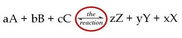
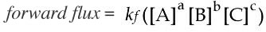
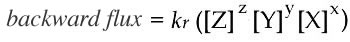
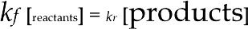
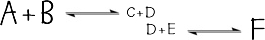
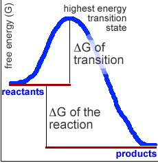

##14. A (very) little thermodynamics

* * * * *

Biological systems obey the rules of chemistry and physics. They involve
complex, coupled networks of chemical reactions which together produce
the behavior we call life.

[Thermodynamic](http://genchem.chem.wisc.edu/netorial/modules/thermodynamics/)
analyses tells us the extent to which a particular reaction **can**
proceed under specific conditions. Every reaction is characterized by
its equilibrium constant, K~eq~.

Reaction kinetics tells us the rate at which the reaction actually
occurs under a particular set of conditions.

Equilibrium is defined as the state where the concentrations of the
reactants [A], [B], [C], … **and** the products [Z], [Y], [X],…, remain
constant over time.

It is a mistake, however, to think that a system at equilibrium is
static. If we were to peer into the system at the molecular level we
would find that even at equilibrium, reactants will be combining to form
products and products will be rearranging to form reactants.

At the same time, because a system is static does not necessarily mean
that it is at equilibrium. A wooden log in the presence of molecular oxygen
(O~2~) is not at equilibrium, even though the O~2~ + log ⇔ CO~2~+ H~2~O
+ heat reaction is highly thermodynamically favorable (more later).

At equilibrium these two processes are balanced, the net flux = 0.

The forward reaction flux equals the back reaction flux.

The equilibrium constant, K~eq~, is defined as the forward rate
constant, *k~f~* divided by the backward rate constant, k~r~.

*Equilibrium constant: Click the image to learn more*

* * * * *

If, at equilibrium, a reaction has gone almost to completion, there will
be very little of the reactants left and lots of the products.

The product of the forward rate constant times the small reactant
concentrations will equal the product of the backward rate constant
times the high product concentrations.

If a reaction’s K~eq~ is greater than one, there will be more product
than reactant at equilibrium.

If the K~*eq*~ is less than one there will be more reactant than
product.

* * * * *

**Coupled Reactions:**

Reactions can be coupled together if they share a common intermediate.
In this example, the two reactions share the component “D”.

Let us assume that the first reaction has an K~eq~ much less than 1,
while the K~eq~ for the second reaction is much greater than 1.

**What will happen?** Most of the D formed by the first reaction (which
is not much), will react with E (assuming E is present) and be removed
from the system.

This will inhibit the C+D “back reaction”, while the A+B “forward
reaction” will continue.

More D will be produced, even though the reaction that produces it is
unfavorable.

* * * * *

**Reaction rates:** What does the equilibrium constant tell us about how
long it will take for a reaction to reach equilibrium?

The somewhat surprising answer is **nothing**!

To understand why, consider the factors that determine the equilibrium
constant and reaction rates. The rate of the reaction is determined by
the molecular pathway that connects the reactants to the products.

We will examine one such reaction pathway using the transport of a
molecule across a membrane as an example.

* * * * *

**Consider this spatial reaction**: (review
[video](http://www.youtube.com/watch?v=a3ewBGC8JbU))\

**A** is a hydrophilic molecule at high concentration outside the cell.
There is a major energy barrier, known as the activation energy,
associated with the spatial reaction: the movement of **A** through the
hydrophobic region of the lipid bilayer.

This barrier is high enough that **A** molecules rarely, if ever, pass
through the membrane, even though the basic reaction itself is quite
favorable. (What is that basic reaction?)

Now, consider how adding a channel to the membrane alters the reaction
kinetics.

The channel “catalyzes” the reaction; it lowers the energy barrier
between the two states, but is not itself used up when the reaction
occurs.

Chemical reactions are similar, although they involve the reorganization
of molecules, rather than their movement from place to place.

The rate of a chemical reaction is determined not by the difference in
the free energy between the reactants and the products, but (to a first
approximation) by the difference in free energy between the reactants
and the highest energy transition state or reaction intermediate.

This is the rate limiting step in the reaction.

The vast majority of biological reactions require a catalyst to occur -
catalysts act by reducing the free energy of the transition state.

In the system we have been considering, the channel is the catalyst.

Most, but not all, biological catalysts are proteins.

Protein catalysts are known as enzymes. RNA catalysts are known as
ribozymes.

<embed width="420" height="345" src="http://www.youtube.com/v/lGbfM9n2jq0" type="application/x-shockwave-flash"> </embed>

*Movie: Temperature and activation energy* 

* * * * *

**Questions to answer**

1.  A reaction is at equilibrium and we increase the amount of reactant,
    what happens in terms of the amount of reactant and product?
2.  A reaction is at equilibrium and we increase the amount of product,
    what happens in terms of the amount of reactant and product?
3.  What does the addition of a catalyst do to a system already at
    equilibrium
4.  What does the addition of a catalyst do to a system far from
    equilibrium?

**Questions to ponder**

-   Where does the energy come from to reach the activation
    state/reaction intermediate?
-   Why does a catalyst not change the equilibrium state of the system?
-   Why are catalysts required for life?

* * * * *